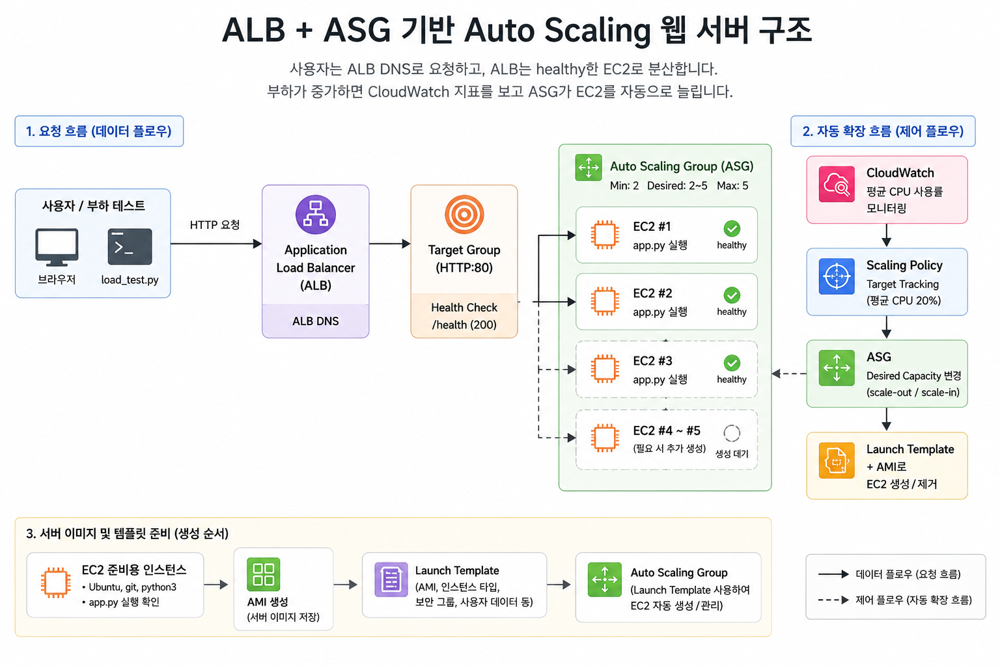

## Assignment: 트래픽 변화에 따라 자동 확장되는 웹 서버



간단한 HTTP 서버를 ALB + ASG로 띄우고, 부하 테스트로 Auto Scaling이 실제로 동작하는 걸 시각화한다.

> [!NOTE]
> 별도 언급이 없는 설정은 AWS 콘솔의 기본값을 그대로 사용한다.

## 0. 사전 준비

- AWS 계정 및 IAM 권한 (EC2, ALB, ASG, CloudWatch)
- 제공된 웹 서버 코드: https://github.com/zero-uuuuk/KeulKeul/tree/main/assignment/week1-auto-scaling-load-balancer/app.py
- 제공된 부하 테스트 스크립트 (Python): https://github.com/zero-uuuuk/KeulKeul/tree/main/assignment/week1-auto-scaling-load-balancer/load_test.py

## 1. 인프라 구성 (AWS 콘솔)

아래 순서대로 구성한다. 순서를 지키지 않으면 연결이 안 되는 경우가 많다.

### 1-1. AMI 준비 (EC2 → 인스턴스)

웹 서버가 설치된 EC2 인스턴스를 만들고 AMI로 저장한다. 이후 ASG가 이 AMI로 서버를 찍어낸다.

> [!NOTE]
> EC2에 SSH로 접속해 파일을 직접 확인하려면 아래 참고 자료를 확인한다.
> - EC2 웹 코드 수정 및 VS Code 접속 가이드: https://choi-hee-yeon.tistory.com/244
> - 원격 서버 SSH config 작성 참고: https://seungriyou.github.io/posts/ssh-vscode/

1. EC2 콘솔 → **인스턴스 시작**
    - AMI: Ubuntu Server 26.04 LTS
    - 인스턴스 타입: `t3.micro`
    - 키페어: 기존 키페어 선택 또는 새로 생성
    - 로컬 터미널에서 `.pem` 키 권한을 `chmod 400 {KEY_FILE}.pem`으로 설정
    - 보안 그룹: 인바운드 HTTP(80), SSH(22)를 **내 IP에서만** 허용
    - **고급 세부 정보** → **사용자 데이터**:
    
    ```bash
    #!/bin/bash
    set -eux
    
    # 웹 코드를 GitHub에서 내려받고 Python 서버를 실행하기 위한 패키지만 설치한다.
    apt-get update -y
    apt-get install -y git python3
    
    # 실습 repository와 웹 서버가 위치한 디렉토리를 정의한다.
    REPO_URL=https://github.com/zero-uuuuk/KeulKeul.git
    REPO_BRANCH=main
    REPO_DIR=/home/ubuntu/KeulKeul
    APP_DIR=$REPO_DIR/assignment/week1-auto-scaling-load-balancer
    
    # 기존 디렉토리가 있으면 제거하고 최신 코드를 얕은 clone으로 내려받는다.
    rm -rf "$REPO_DIR"
    git clone --depth 1 --branch "$REPO_BRANCH" "$REPO_URL" "$REPO_DIR"
    chown -R ubuntu:ubuntu "$REPO_DIR"
    
    # 80번 포트로 웹 서버를 백그라운드 실행하고 로그를 파일에 남긴다.
    cd "$APP_DIR"
    nohup python3 -u app.py > app.log 2>&1 &
    ```
    
    - 사용자 데이터 실행 전, `app.py`가 GitHub repository에 push되어 있어야 한다.
    
2. 로컬 터미널에서 EC2 Public IPv4 주소로 웹 서버 응답 확인
    
    ```bash
    curl http://{EC2_PUBLIC_IP}/health
    curl http://{EC2_PUBLIC_IP}/
    ```
    
3. EC2 콘솔 → 인스턴스 선택 → **작업 → 이미지 및 템플릿 → 이미지 생성**
    - 이미지 이름 입력 후 생성
    - EC2 콘솔 → AMIs에서 `available` 상태가 될 때까지 대기
    - AMI 생성이 완료되면 AMI 준비용으로 띄운 기존 EC2 인스턴스는 종료

### 1-2. 대상 그룹 생성 (EC2 → 로드 밸런싱 → 대상 그룹)

ALB가 트래픽을 보낼 대상 그룹. 헬스 체크 설정이 여기에 있다.

1. **대상 그룹 생성** 클릭
2. 설정값:
    - 대상 유형: `인스턴스`
    - Protocol: `HTTP`, Port: `80` (웹 서버 포트에 맞게)
3. **상태 확인** 설정:
    - Health check protocol: `HTTP`
    - Health check path: `/health`
    - **고급 상태 확인 설정** 펼치기:
        - 정상 임계값: `2`
        - 비정상 임계값: `2`
        - 제한 시간: `5`초
        - 간격: `30`초
        - 성공 코드: `200`
4. **다음** → 인스턴스 등록 없이 **대상 그룹 생성**

### 1-3. ALB 생성 (EC2 → 로드 밸런서)

1. **로드 밸런서 생성** → **애플리케이션 로드 밸런서** 선택
2. 기본 설정:
    - 이름: 적절한 이름 입력
    - 체계: `Internet-facing`
    - IP address type: `IPv4`
3. 네트워크 매핑:
    - **가용 영역**: 최소 2개의 AZ 선택, 각각 퍼블릭 서브넷 지정
4. 보안 그룹:
    - ALB용 보안 그룹 새로 생성
    - 인바운드 HTTP(80)를 내 IP에서만 허용
5. 리스너 및 라우팅:
    - Protocol: `HTTP`, Port: `80`
    - 기본 작업: 1-2에서 만든 대상 그룹 선택
6. **로드 밸런서 생성**
7. 생성 완료 후 ALB의 **DNS 이름** 복사해두기 (부하 테스트에 사용)

### 1-4. 시작 템플릿 생성 (EC2 → 시작 템플릿)

ASG가 새 서버를 띄울 때 사용할 템플릿.

1. **시작 템플릿 생성** 클릭
2. 설정값:
    - 시작 템플릿 이름: 적절한 이름 입력
    - **내 AMI** → 1-1에서 만든 AMI 선택
    - 인스턴스 유형: `t3.micro`
    - 키 페어: 기존 키페어 선택
    - 보안 그룹: 1-1에서 만든 EC2용 보안 그룹 재사용
    - 해당 보안 그룹의 인바운드 규칙에 ALB 보안 그룹에서 오는 HTTP(80)를 추가
3. **고급 세부 정보** → **사용자 데이터**:
    - 웹 서버를 자동으로 실행하는 스크립트 입력
    
    ```bash
    #!/bin/bash
    set -eux
    
    # AMI에 포함된 repository 경로에서 웹 서버 디렉토리로 이동한다.
    APP_DIR=/home/ubuntu/KeulKeul/assignment/week1-auto-scaling-load-balancer
    cd "$APP_DIR"
    
    # ASG가 새 인스턴스를 띄울 때마다 80번 포트로 웹 서버를 백그라운드 실행한다.
    nohup python3 -u app.py > app.log 2>&1 &
    ```
    
4. **시작 템플릿 생성**

### 1-5. Auto Scaling 그룹 생성 (EC2 → Auto Scaling 그룹)

1. **Auto Scaling 그룹 생성** 클릭
2. **1단계 - 시작 템플릿 선택**:
    - 이름: 적절한 이름 입력
    - 시작 템플릿: 1-4에서 만든 템플릿 선택
3. **2단계 - 인스턴스 시작 옵션 선택**:
    - 가용 영역: 최소 2개 AZ의 퍼블릭 서브넷 선택
4. **3단계 - 고급 옵션 구성**:
    - 로드 밸런싱: **기존 로드 밸런서에 연결** 선택
    - 대상 그룹: 1-2에서 만든 대상 그룹 선택
    - 상태 확인: **Elastic Load Balancing 상태 확인 켜기** 체크
    - 상태 확인 유예 기간: `120`초
5. **4단계 - 그룹 크기 및 조정 구성**:
    - 희망 용량: `2`
    - 최소 용량: `2`
    - 최대 용량: `5`
    - 자동 조정: **대상 추적 크기 조정 정책** 선택
        - 크기 조정 정책 이름: 적절한 이름 입력
        - 지표 유형: `평균 CPU 사용률`
        - 대상 값: `20`
        - 인스턴스 워밍업: `120`초
    - CloudWatch 내에서 그룹 지표 수집 활성화: 켜기
6. **5, 6단계**: 기본값 유지
7. **Auto Scaling 그룹 생성**

구성 완료 후 확인할 것:

- ASG 콘솔 → **인스턴스 관리** 탭에서 인스턴스 2대가 `InService` 상태인지 확인
- EC2 콘솔 → **로드 밸런싱** → **대상 그룹** → 해당 대상 그룹 → **대상** 탭에서 2대가 `healthy` 상태인지 확인 (최대 2분 소요)
- 로컬 브라우저 또는 로컬 터미널에서 ALB DNS로 응답 확인:
    
    ```bash
    curl http://{ALB_DNS}/# Hello from {hostname} 응답 확인
    ```
    

## 2. 부하 테스트

로컬 터미널에서 제공된 Python 스크립트를 실행한다. `ALB_DNS`를 실제 ALB 주소로 교체한다.

```bash
python3 load_test.py --host http://{ALB_DNS}
```

스크립트는 아래 순서로 부하를 준다.

| 구간 | 시간 | 내용 |
| --- | --- | --- |
| 워밍업 | 3분 | 낮은 부하로 시작 |
| 폭증 | 6분 | 부하를 급격히 높여 스케일링 유도 |
| 정상 복귀 | 3분 | 부하를 낮춤 |
| scale-in 관찰 | 15분 | 서버 수가 줄어드는지 관찰 |

> [!NOTE]
> scale-in은 scale-out보다 보수적으로 동작한다. 부하가 줄어든 뒤에도 CloudWatch 지표 집계, Target Tracking 정책 판단, 인스턴스 워밍업 상태 반영 때문에 서버 수가 줄어드는 데 시간이 걸릴 수 있다.
> 15분 안에 scale-in이 관찰되지 않아도 정상일 수 있다. 관찰 시간이 끝나면 테스트를 그대로 종료하고 리소스 정리 단계로 넘어간다.

실행 중 확인할 것:

- 터미널에서 응답 시간과 에러율을 실시간으로 관찰한다.
- ASG 콘솔 → **인스턴스 관리** 탭에서 인스턴스 수가 2대보다 늘어나는지 확인한다.
- **스케일링이 일어나지 않으면**: CPU가 20%를 넘지 않는 것이 원인일 가능성이 높다. `--work-ms` 값을 높여 재실행한다.
- 부하 테스트는 반드시 ALB DNS 주소로 실행한다. EC2 인스턴스에 직접 요청하면 LB를 거치지 않아 스케일링이 관찰되지 않는다.

## 3. 시각화 (CloudWatch)

부하 테스트 실행 중, 그리고 완료 후 CloudWatch에서 아래를 캡처한다.

### 3-1. ASG 지표 확인

CloudWatch 콘솔 → **지표** → **Auto Scaling** → 해당 ASG 선택

아래 두 지표를 같은 그래프에 추가한다.

- `GroupDesiredCapacity` — ASG가 목표로 하는 서버 수
- `GroupInServiceInstances` — 실제로 트래픽을 받는 서버 수

**정상적으로 스케일링이 일어났다면** 그래프에서 아래 흐름이 보여야 한다.

- 부하 전: `GroupInServiceInstances = 2`
- 폭증 구간: `GroupDesiredCapacity`가 올라가고, 잠시 후 `GroupInServiceInstances`가 따라 올라감
- 정상 복귀 후: 두 값이 다시 `2`로 내려옴

### 3-2. ALB 지표 확인

CloudWatch 콘솔 → **지표** → **ApplicationELB** → 해당 ALB 선택

아래 지표를 확인한다.

- `TargetResponseTime` — 서버 응답 시간
    - 통계: `p95` (상위 5% 느린 요청의 응답 시간)
    - 폭증 구간에서 올랐다가 새 서버가 투입되면서 내려오는 흐름을 확인
- `HTTPCode_Target_5XX_Count` — 서버 측 에러 수
    - 통계: `Sum`
    - 스케일링이 늦는 구간에 5xx가 얼마나 발생했는지 확인
- `HealthyHostCount` — LB 기준으로 healthy한 서버 수
    - 통계: `Average`
    - ASG의 `GroupInServiceInstances`와 비교해서 같은 시점에 올라가는지 확인

## 4. 주의사항

과제 완료 후 반드시 아래 순서로 리소스를 삭제한다. 방치하면 EC2, ALB, EBS snapshot 비용이 계속 발생할 수 있다.

> [!IMPORTANT]
> ASG를 먼저 삭제해야 한다. ASG가 남아 있으면 EC2 인스턴스를 종료해도 희망 용량을 맞추기 위해 새 인스턴스를 다시 생성할 수 있다.

1. **ASG 삭제**
    - EC2 콘솔 → **Auto Scaling 그룹**으로 이동한다.
    - 실습에서 만든 ASG를 선택하고 **삭제**를 클릭한다.
    - 삭제 확인 창이 나오면 안내에 따라 확인 문구를 입력한다.
    - 삭제 후 EC2 인스턴스 목록에서 ASG가 만든 인스턴스가 종료되는지 확인한다.

2. **ALB 삭제**
    - EC2 콘솔 → **로드 밸런싱** → **로드 밸런서**로 이동한다.
    - 실습에서 만든 ALB를 선택하고 **작업 → 로드 밸런서 삭제**를 클릭한다.
    - 삭제가 완료될 때까지 기다린다.

3. **대상 그룹 삭제**
    - EC2 콘솔 → **로드 밸런싱** → **대상 그룹**으로 이동한다.
    - 실습에서 만든 대상 그룹을 선택하고 **작업 → 삭제**를 클릭한다.
    - ALB가 아직 연결되어 있으면 삭제되지 않으므로, ALB 삭제 완료 후 진행한다.

4. **시작 템플릿 삭제**
    - EC2 콘솔 → **시작 템플릿**으로 이동한다.
    - 실습에서 만든 시작 템플릿을 선택하고 **작업 → 템플릿 삭제**를 클릭한다.
    - 시작 템플릿은 비용이 직접 발생하지는 않지만, 실습 리소스 정리를 위해 삭제한다.

5. **AMI 등록 취소 및 snapshot 삭제**
    - EC2 콘솔 → **AMI**로 이동한다.
    - 1-1에서 만든 AMI를 선택하고 **작업 → AMI 등록 취소**를 클릭한다.
    - AMI 등록 취소 후, 연결된 EBS snapshot ID를 확인한다.
    - EC2 콘솔 → **스냅샷**으로 이동해 해당 snapshot을 선택하고 **작업 → 스냅샷 삭제**를 클릭한다.
    - snapshot은 AMI를 등록 취소해도 자동 삭제되지 않으므로 반드시 별도로 삭제한다.

6. **남은 EC2 인스턴스와 EBS 볼륨 확인**
    - EC2 콘솔 → **인스턴스**에서 실습용 인스턴스가 남아 있으면 **인스턴스 상태 → 인스턴스 종료**를 클릭한다.
    - EC2 콘솔 → **볼륨**에서 실습용 EBS 볼륨이 남아 있지 않은지 확인한다.
    - 인스턴스 생성 시 `Delete on termination`이 켜져 있지 않았다면 볼륨이 남을 수 있으므로 확인한다.
