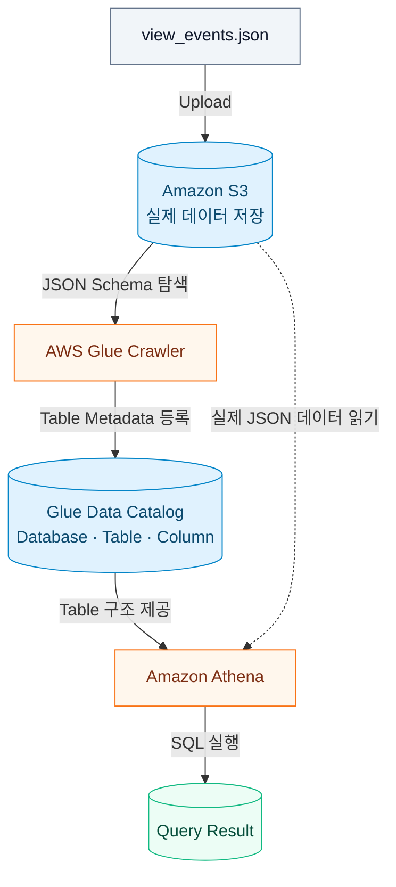

# Assignment: Glue Crawler로 S3 데이터를 등록하고 Athena로 조회하기

OTT 서비스의 가상 시청 이벤트 JSON 10,000건을 Amazon S3에 업로드한다. AWS Glue Crawler로 JSON 구조를 분석해 Data Catalog에 Table을 등록하고, Amazon Athena에서 SQL로 인기 작품과 장르를 조회한다.

> [!IMPORTANT]
> S3, Glue Crawler, Athena 사용에는 비용이 발생할 수 있다. 제공된 작은 데이터만 사용하고 실습이 끝나면 생성한 Resource를 삭제한다.

## 0. 사전 준비

- AWS 계정
- AWS Console 사용 권한
  - Amazon S3
  - AWS Glue
  - Amazon Athena
  - AWS IAM
- 실습 Region: `ap-northeast-2`
- 제공 데이터: `data/view_events.json`

AWS Console 오른쪽 위에서 Region이 `ap-northeast-2`인지 확인한다. S3 Bucket은 전역 Resource지만 Glue Data Catalog와 Athena는 Region의 영향을 받으므로 실습 내내 같은 Region을 사용한다.

## 1. 전체 구조 이해하기



| Service | 역할 |
| --- | --- |
| Amazon S3 | 실제 JSON 데이터 저장 |
| Glue Crawler | JSON의 Field와 Data Type 탐색 |
| Glue Data Catalog | Database와 Table Metadata 저장 |
| Amazon Athena | Data Catalog를 참고해 S3 데이터에 SQL 실행 |

> [!NOTE]
> Glue Crawler는 JSON을 Database로 이동하거나 변환하지 않는다. 실제 데이터는 계속 S3에 있고, Data Catalog에는 JSON을 읽는 데 필요한 Metadata만 저장된다.

## 2. 제공 데이터 확인하기

`data/view_events.json`에는 가상 OTT 서비스의 시청 이벤트 10,000건이 JSON Lines 형식으로 들어 있다. 한 줄이 하나의 시청 이벤트다.

```json
{"event_time":"2026-09-01T00:00:00","viewer_id":"viewer-1825","title":"Cosmic Taxi","genre":"sf","device":"mobile","watch_minutes":31}
{"event_time":"2026-09-01T00:05:00","viewer_id":"viewer-0915","title":"Last Call","genre":"thriller","device":"tv","watch_minutes":52}
```

| Column | 의미 |
| --- | --- |
| `event_time` | 시청 시작 시각 |
| `viewer_id` | 가상 시청자 ID |
| `title` | 작품 이름 |
| `genre` | 작품 장르 |
| `device` | 시청 기기 |
| `watch_minutes` | 시청 시간(분) |

## 3. S3 Bucket 생성하기

AWS Console에서 S3로 이동한다.

1. **Create bucket** 선택
2. Bucket 이름 입력
3. AWS Region으로 `ap-northeast-2` 선택
4. 나머지는 기본값 유지
5. **Create bucket** 선택

Bucket 이름은 전 세계에서 고유해야 한다. 아래 이름의 `ACCOUNT_ID`를 자신의 AWS 계정 ID로 바꾼다.

```text
keulkeul-week10-ACCOUNT_ID
```

생성한 Bucket 안에 다음 Folder를 만든다.

```text
view-events/
athena-results/
```

최종 구조는 다음과 같다.

```text
s3://keulkeul-week10-ACCOUNT_ID/
├── view-events/
└── athena-results/
```

## 4. JSON을 S3에 Upload하기

S3 Console에서 `view-events/` Folder를 연다.

1. **Upload** 선택
2. **Add files** 선택
3. 제공된 `data/view_events.json` 선택
4. **Upload** 선택

Upload 후 다음 위치에 파일이 보이는지 확인한다.

```text
s3://keulkeul-week10-ACCOUNT_ID/view-events/view_events.json
```

## 5. Glue Database 생성하기

AWS Console에서 **AWS Glue**로 이동한다.

1. 왼쪽 메뉴에서 **Data Catalog → Databases** 선택
2. **Add database** 선택
3. Database 이름에 `week10_athena` 입력
4. **Create database** 선택

## 6. Glue Crawler 생성하기

왼쪽 메뉴에서 **Data Catalog → Crawlers**로 이동한다.

### 6-1. Crawler 정보

1. **Create crawler** 선택
2. Crawler 이름에 `week10-view-events-crawler` 입력
3. **Next** 선택

### 6-2. Data Source

1. **Is your data already mapped to Glue tables?**에서 **Not yet** 선택
2. **Add a data source** 선택
3. Data Source로 **S3** 선택
4. **Location of S3 data**에서 **In this account** 선택
5. S3 경로에 아래 주소 입력

```text
s3://keulkeul-week10-ACCOUNT_ID/view-events/
```

6. 이후 Crawl 설정에서 전체 하위 Folder를 탐색하도록 선택
7. **Add an S3 data source** 선택
8. **Next** 선택

### 6-3. IAM Role

Crawler가 S3 파일을 읽고 Data Catalog에 Table을 만들 수 있도록 IAM Role을 생성한다.

1. **Create new IAM role** 선택
2. 이름에 `week10-athena` 입력
3. 생성된 Role 확인

Console에는 다음과 비슷한 이름으로 표시된다.

```text
AWSGlueServiceRole-week10-athena
```

### 6-4. Target과 Schedule

1. Target Database로 `week10_athena` 선택
2. Crawler Schedule로 **On demand** 선택
3. 설정 검토
4. **Create crawler** 선택

## 7. Crawler 실행하기

Crawler 목록에서 `week10-view-events-crawler`를 선택하고 **Run crawler**를 실행한다.

Crawler 상태가 `Ready`로 돌아오고 Last run status가 `Succeeded`인지 확인한다.

이후 **Data Catalog → Tables**에서 생성된 Table을 확인한다. 제공된 S3 구조에서는 일반적으로 다음 이름으로 생성된다.

```text
view_events
```

실제 Table 이름이 다르면 이후 SQL의 `view_events`를 Console에 표시된 이름으로 바꾼다.

Table의 Column도 확인한다.

```text
event_time
viewer_id
title
genre
device
watch_minutes
```

Crawler가 추론한 Data Type은 환경이나 데이터에 따라 조금 다를 수 있다. `watch_minutes`가 숫자 형식으로 추론됐는지 확인한다.

## 8. Athena Query Result 위치 설정하기

AWS Console에서 **Amazon Athena**로 이동한다.

1. Query editor 열기
2. Workgroup으로 `primary` 선택
3. Data Source로 `AwsDataCatalog` 선택
4. Catalog에서 기본 AWS Glue Data Catalog 선택
5. Database로 `week10_athena` 선택

Query Result 위치를 요구하면 다음 순서로 S3 경로를 지정한다.

1. **Settings** 선택
2. **Manage** 선택
3. **Location of query result**에 아래 주소 입력

```text
s3://keulkeul-week10-ACCOUNT_ID/athena-results/
```

4. **Save** 선택

> [!NOTE]
> Workgroup이 Athena Managed Query Results를 사용하도록 설정돼 있다면 별도의 S3 Query Result 위치를 입력하지 않아도 된다.

## 9. 데이터 조회하기

전체 이벤트 수를 조회한다.

```sql
SELECT COUNT(*) AS event_count
FROM "week10_athena"."view_events";
```

결과가 `10000`인지 확인한 뒤 10개의 Row를 조회한다.

```sql
SELECT *
FROM "week10_athena"."view_events"
LIMIT 10;
```

**Run**을 선택하고 JSON의 데이터가 표 형태로 출력되는지 확인한다.

### 9-1. 인기 작품 조회

작품별 이벤트 수와 총 시청 시간을 조회한다.

```sql
SELECT
    title,
    COUNT(*) AS view_count,
    SUM(watch_minutes) AS total_watch_minutes
FROM "week10_athena"."view_events"
GROUP BY title
ORDER BY view_count DESC, total_watch_minutes DESC;
```

### 9-2. 장르별 시청 현황 조회

```sql
SELECT
    genre,
    COUNT(*) AS view_count,
    ROUND(AVG(watch_minutes), 1) AS average_watch_minutes
FROM "week10_athena"."view_events"
GROUP BY genre
ORDER BY view_count DESC;
```

### 9-3. 기기별 이용 현황 조회

```sql
SELECT
    device,
    COUNT(*) AS view_count
FROM "week10_athena"."view_events"
GROUP BY device
ORDER BY view_count DESC;
```

## 10. 최종 확인

아래 항목을 순서대로 확인한다.

- S3 `view-events/`에 JSON이 Upload됐는가?
- Glue Crawler 실행 상태가 `Succeeded`인가?
- `week10_athena` Database에 Table이 생성됐는가?
- Table에 여섯 개 Column이 등록됐는가?
- 전체 이벤트 수가 10,000건인가?
- Athena에서 `SELECT` Query가 실행되는가?
- 인기 작품, 장르, 기기를 SQL로 확인했는가?
- 실제 데이터와 Metadata의 저장 위치 차이를 설명할 수 있는가?

## 11. Resource 정리

실습이 끝나면 다음 순서로 Resource를 삭제한다.

1. Glue Crawler `week10-view-events-crawler` 삭제
2. Glue Table `view_events` 삭제
3. Glue Database `week10_athena` 삭제
4. S3 Bucket 안의 객체 전체 삭제
5. S3 Bucket `keulkeul-week10-ACCOUNT_ID` 삭제
6. 실습에서 생성한 IAM Role `AWSGlueServiceRole-week10-athena` 삭제

> [!IMPORTANT]
> Glue Table을 삭제해도 S3의 원본 JSON은 자동으로 삭제되지 않는다. Data Catalog의 Metadata와 S3의 실제 데이터는 별도로 정리해야 한다.
