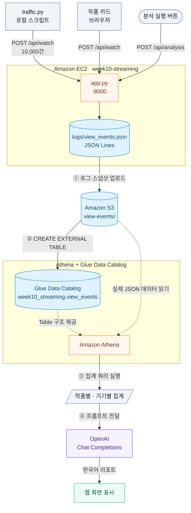

## Assignment: EC2와 Athena, OpenAI로 OTT 시청 로그 분석 웹 만들기

OTT 웹 서버를 EC2에 배포하고, 로컬 스크립트로 원격 서버에 시청 요청 10,000건을 보낸다. 쌓인 로그를 웹 화면의 버튼 하나로 S3에 업로드하고, Athena로 집계한 뒤, OpenAI가 작성한 한국어 분석 리포트를 화면에서 확인한다.

> [!IMPORTANT]
> EC2, S3, Athena 사용에는 AWS 비용이, OpenAI 호출에는 별도 API 사용료가 발생한다. 실습이 끝나면 12장 순서대로 리소스를 삭제한다.

## 0. 전체 흐름 이해하기

### 0-1. 사용자 흐름

먼저 시청 로그를 쌓는다.

```text
1. 로컬 터미널에서 traffic.py 실행
2. traffic.py가 서버의 GET /api/catalog를 호출해 작품 목록을 받음
3. traffic.py가 작품, 기기, 시청 시간을 무작위로 골라 POST /api/watch를 10,000번 호출
4. EC2 웹 서버가 요청마다 이벤트 한 건을 logs/view_events.json에 한 줄씩 기록
5. 사용자가 브라우저에서 작품 카드를 직접 클릭
6. 같은 POST /api/watch가 호출되고, source만 user로 기록됨
```

로그가 쌓이면 웹 화면에서 분석을 실행한다.

```text
1. 사용자가 분석 실행 버튼 클릭
2. POST /api/analysis 호출 -> 서버가 백그라운드에서 작업을 시작하고 job_id를 즉시 반환
3. 웹 화면이 GET /api/analysis/{job_id}를 1초마다 호출하며 단계별 상태를 갱신
4. 1단계: 로그 스냅샷을 S3 view-events/ 경로에 업로드
5. 2단계: Athena DDL로 Database와 External Table 생성
6. 3단계: 작품별, 기기별 집계 쿼리 두 개 실행
7. 4단계: 집계 결과를 OpenAI Chat Completions API에 전달
8. 5단계: 생성된 한국어 리포트를 화면에 표시
```

### 0-2. 전체 아키텍처



### 0-3. 분석 단계별 역할

| 단계 | 서버가 하는 일 | 화면에 표시되는 정보 |
| --- | --- | --- |
| 1. S3 Upload | 로그 스냅샷을 `view-events/view_events.json`에 업로드 | 이벤트 수, 파일 크기, S3 URI |
| 2. Athena Table 생성 | DDL로 Database와 External Table 생성 | Database 이름, Table 이름 |
| 3. Athena Query 실행 | 작품별, 기기별 집계 쿼리 두 개 실행 | 쿼리 ID 두 개, 조회된 행 수 |
| 4. AI 분석 | 집계 결과를 OpenAI에 전달하고 리포트 수신 | 사용한 Model 이름 |

### 0-4. API 역할

| Method | Path | 역할 |
| --- | --- | --- |
| `GET` | `/health` | 서버가 살아 있는지 확인한다. |
| `GET` | `/api/catalog` | 작품 목록과 기기 목록을 조회한다. |
| `POST` | `/api/watch` | 시청 이벤트 한 건을 로그 파일에 기록한다. |
| `GET` | `/api/stats` | 지금까지 기록된 이벤트 수를 조회한다. |
| `POST` | `/api/analysis` | 분석 작업을 시작하고 `job_id`를 반환한다. |
| `GET` | `/api/analysis/{job_id}` | 분석 단계별 상태와 리포트를 조회한다. |

### 0-5. 시청 로그 형식

서버는 `logs/view_events.json`에 JSON Lines 형식으로 기록한다. 한 줄이 시청 이벤트 한 건이다.

```json
{"event_time":"2026-09-16T12:45:32+00:00","viewer_id":"viewer-2106","title":"Last Call","genre":"thriller","device":"tv","watch_minutes":29,"source":"traffic"}
```

| 필드 | 의미 |
| --- | --- |
| `event_time` | 서버가 요청을 받은 시각 (UTC) |
| `viewer_id` | 가상 또는 실제 사용자 ID |
| `title` | 선택한 작품 |
| `genre` | 작품 장르 |
| `device` | 접속 기기 |
| `watch_minutes` | 시청 시간(분) |
| `source` | `traffic`이면 스크립트, `user`면 브라우저에서 직접 선택 |

## 1. 사전 준비

필요한 것:
- AWS 계정과 콘솔 사용 권한 (EC2, S3, Athena, IAM)
- OpenAI Platform 계정과 결제 수단
- 로컬에 설치된 AWS CLI와 Python 3.11 이상
- 실습 리전: `ap-northeast-2`
- 제공된 EC2 배포 코드: [`app/`](./app)
- 제공된 요청 생성 스크립트: [`traffic/traffic.py`](./traffic/traffic.py)
- 로컬 터미널 환경 (macOS 또는 Linux 권장)

폴더 구조:

```text
level2-athena-bedrock/
├── app/                  <- EC2에 배포되는 웹 서버
│   ├── app.py            시청 이벤트 기록과 분석 작업 API
│   ├── analysis.py       S3 업로드, Athena 쿼리, OpenAI 호출 워크플로
│   ├── index.html        작품 카드, 진행 상태, 분석 리포트 화면
│   ├── requirements.txt  boto3
│   └── .env.example      OPENAI_API_KEY 작성 예시
└── traffic/              <- 로컬에서 실행하는 스크립트
    └── traffic.py        원격 서버에 시청 요청 대량 전송
```

이 실습에서 만들 리소스:

| 리소스 | 이름 |
| --- | --- |
| S3 Bucket | `keulkeul-week10-level2-{ACCOUNT_ID}` |
| IAM Role | `week10-streaming-ec2-role` |
| 보안 그룹 | `week10-streaming-sg` |
| 키페어 | `week10-streaming-key` |
| EC2 인스턴스 | `week10-streaming` |
| Athena Database | `week10_streaming` |
| Athena Table | `view_events` |

## 2. OpenAI API Key 발급하기

### 2-1. Key 생성

1. https://platform.openai.com 접속 후 로그인
2. 오른쪽 위 **Settings** → **API keys**로 이동
3. **Create new secret key** 클릭
4. 설정값 입력
    - Name: `keulkeul-week10`
    - Project: 기본값
    - Permissions: `All`
5. **Create secret key** 클릭
6. 표시된 Key를 바로 복사해 안전한 곳에 붙여넣는다

### 2-2. 크레딧 확인

1. **Settings** → **Billing**으로 이동
2. 결제 수단이 등록되어 있는지 확인
3. 잔액이 0이면 최소 금액을 충전

## 3. 로컬에서 먼저 실행해 보기

`app` 폴더에서 실행 환경을 준비하고 자체 점검을 돌린다.

```bash
cd app
python -m venv .venv
source .venv/bin/activate
pip install -r requirements.txt
python analysis.py
```

```text
self-check 통과
```

같은 터미널에서 서버를 띄운다.

```bash
python app.py --port 8000
```

다른 터미널을 열어 `traffic` 폴더에서 요청을 보낸다.

```bash
cd traffic
python traffic.py --url http://127.0.0.1:8000 --count 100 --concurrency 10
```

```text
작품 8종 / 기기 4종 확인. 100건 전송 시작 (동시성 10)

완료: 성공 100건 / 실패 0건 / 0.1초
```

브라우저로 http://127.0.0.1:8000 에 접속해 작품 카드를 누르면 이벤트 수가 올라가는지 확인한다.

## 4. S3 Bucket 만들기

**로컬 터미널**에서 계정 ID를 먼저 확인한다.

```bash
aws sts get-caller-identity --query Account --output text
```

1. AWS 콘솔 → **S3**로 이동
2. **Create bucket** 클릭
3. 설정값 입력
    - Bucket name: `keulkeul-week10-level2-{ACCOUNT_ID}`
    - AWS Region: `아시아 태평양(서울) ap-northeast-2`
    - Object Ownership: 기본값
    - Block Public Access: 기본값 (모두 차단)
    - Bucket Versioning: 기본값
    - Default encryption: 기본값
4. **Create bucket** 클릭

사용할 경로는 두 개다. 프로그램이 파일을 쓸 때 자동으로 생긴다.

```text
s3://keulkeul-week10-level2-{ACCOUNT_ID}/
├── view-events/view_events.json   <- 웹 서버가 업로드하는 시청 로그
└── athena-results/                <- Athena가 쿼리 결과를 쓰는 곳
```

> [!WARNING]
> Athena External Table의 `LOCATION`은 경로(prefix) 전체를 읽는다. `athena-results/`는 반드시 `view-events/` 바깥에 둔다. 두 경로가 겹치면 쿼리가 실패한다.

## 5. IAM Role 만들기

### 5-1. Role 생성

1. AWS 콘솔 → **IAM** → **Roles**로 이동
2. **Create role** 클릭
3. 설정값 입력
    - Trusted entity type: `AWS service`
    - Use case: `EC2`
4. **Next** 클릭
5. Permission policies는 비운 채로 **Next** 클릭
6. Role name: `week10-streaming-ec2-role`
7. **Create role** 클릭

### 5-2. Inline policy 추가

1. `week10-streaming-ec2-role` 선택
2. **Add permissions** → **Create inline policy** 클릭
3. **JSON** 탭 선택
4. 아래 JSON에서 `{ACCOUNT_ID}`를 본인 계정 ID로 바꿔 입력

```json
{
  "Version": "2012-10-17",
  "Statement": [
    {
      "Sid": "LabBucket",
      "Effect": "Allow",
      "Action": ["s3:GetBucketLocation", "s3:ListBucket"],
      "Resource": "arn:aws:s3:::keulkeul-week10-level2-{ACCOUNT_ID}"
    },
    {
      "Sid": "LabBucketObjects",
      "Effect": "Allow",
      "Action": ["s3:GetObject", "s3:PutObject", "s3:AbortMultipartUpload"],
      "Resource": "arn:aws:s3:::keulkeul-week10-level2-{ACCOUNT_ID}/*"
    },
    {
      "Sid": "AthenaQuery",
      "Effect": "Allow",
      "Action": [
        "athena:StartQueryExecution",
        "athena:GetQueryExecution",
        "athena:GetQueryResults"
      ],
      "Resource": "arn:aws:athena:ap-northeast-2:{ACCOUNT_ID}:workgroup/primary"
    },
    {
      "Sid": "GlueDataCatalog",
      "Effect": "Allow",
      "Action": [
        "glue:CreateDatabase",
        "glue:GetDatabase",
        "glue:GetDatabases",
        "glue:CreateTable",
        "glue:GetTable",
        "glue:GetTables",
        "glue:GetPartitions"
      ],
      "Resource": [
        "arn:aws:glue:ap-northeast-2:{ACCOUNT_ID}:catalog",
        "arn:aws:glue:ap-northeast-2:{ACCOUNT_ID}:database/week10_streaming",
        "arn:aws:glue:ap-northeast-2:{ACCOUNT_ID}:table/week10_streaming/*"
      ]
    }
  ]
}
```

5. **Next** 클릭
6. Policy name: `week10-streaming-inline`
7. **Create policy** 클릭

## 6. 보안 그룹 만들기

1. AWS 콘솔 → **EC2** → **네트워크 및 보안** → **보안 그룹**으로 이동
2. **보안 그룹 생성** 클릭
3. 설정값 입력
    - 보안 그룹 이름: `week10-streaming-sg`
    - 설명: `Week10 OTT streaming log analyzer`
    - VPC: 기본 VPC
4. **인바운드 규칙**에서 **규칙 추가**를 눌러 두 개를 추가

| 유형 | 포트 범위 | 소스 | 설명 |
| --- | --- | --- | --- |
| 사용자 지정 TCP | `8000` | `내 IP` | 웹 화면 접속과 traffic.py 요청 |
| SSH | `22` | `내 IP` | API Key 설정을 위한 SSH 접속 |

5. 아웃바운드 규칙은 기본값
6. **보안 그룹 생성** 클릭

> [!IMPORTANT]
> `내 IP`는 지금 사용 중인 공인 IP만 허용한다. 네트워크가 바뀌면 인바운드 규칙의 IP를 현재 값으로 다시 저장한다.

## 7. 키페어 만들기

1. AWS 콘솔 → **EC2** → **네트워크 및 보안** → **키 페어**로 이동
2. **키 페어 생성** 클릭
3. 설정값 입력
    - 이름: `week10-streaming-key`
    - 키 페어 유형: `RSA`
    - 프라이빗 키 파일 형식: `.pem`
4. **키 페어 생성** 클릭
5. 내려받아진 `week10-streaming-key.pem`을 찾기 쉬운 경로에 둔다
6. 로컬 터미널에서 파일 권한을 제한한다

```bash
chmod 400 ~/Downloads/week10-streaming-key.pem
```

> [!IMPORTANT]
> `.pem` 파일도 생성 시점에 한 번만 내려받을 수 있다. 권한이 `400`보다 열려 있으면 SSH가 접속을 거부한다.

## 8. EC2 인스턴스 시작하기

### 8-1. 인스턴스 생성

1. AWS 콘솔 → **EC2** → **인스턴스**로 이동
2. **인스턴스 시작** 클릭
3. 설정값 입력
    - 이름: `week10-streaming`
    - AMI: `Ubuntu Server 24.04 LTS` 이상
    - 아키텍처: `64비트(x86)`
    - 인스턴스 유형: `t3.medium`
    - 키 페어: `week10-streaming-key`
4. **네트워크 설정** → **기존 보안 그룹 선택** → `week10-streaming-sg` 선택
5. **고급 세부 정보**를 펼친다
    - IAM 인스턴스 프로파일: `week10-streaming-ec2-role`
6. **고급 세부 정보** 맨 아래 **사용자 데이터**에 아래 스크립트 입력
    - `{ACCOUNT_ID}`를 본인 계정 ID로 바꾼다

```bash
#!/bin/bash
set -eux

apt-get update
apt-get install -y git python3-boto3

git clone --depth 1 https://github.com/zero-uuuuk/KeulKeul.git /opt/keulkeul
chown -R ubuntu:ubuntu /opt/keulkeul

cat > /etc/systemd/system/week10.service <<'UNIT'
[Unit]
Description=Week10 OTT streaming log analyzer
After=network-online.target

[Service]
User=ubuntu
WorkingDirectory=/opt/keulkeul/assignment/week10-athena/level2-athena-bedrock/app
EnvironmentFile=-/opt/keulkeul/assignment/week10-athena/level2-athena-bedrock/app/.env
Environment=AWS_REGION=ap-northeast-2
Environment=S3_BUCKET=keulkeul-week10-level2-{ACCOUNT_ID}
Environment=ATHENA_DATABASE=week10_streaming
Environment=ATHENA_TABLE=view_events
ExecStart=/usr/bin/python3 app.py --port 8000
Restart=always

[Install]
WantedBy=multi-user.target
UNIT

systemctl enable --now week10
```

7. **인스턴스 시작** 클릭
8. 상태 검사가 `2/2개 검사 통과`가 될 때까지 기다린다
9. **퍼블릭 IPv4 주소**를 메모한다

환경 변수는 다섯 개다. 넷은 User Data에서, `OPENAI_API_KEY`만 9장에서 `.env`로 설정한다.

| 이름 | 값 | 설정 위치 |
| --- | --- | --- |
| `AWS_REGION` | `ap-northeast-2` | User Data |
| `S3_BUCKET` | `keulkeul-week10-level2-{ACCOUNT_ID}` | User Data |
| `ATHENA_DATABASE` | `week10_streaming` | User Data |
| `ATHENA_TABLE` | `view_events` | User Data |
| `OPENAI_API_KEY` | `sk-...` | `.env` (9장) |

### 8-2. 부팅 확인

User Data 실행에 1~2분 걸린다.

```bash
curl http://{EC2_PUBLIC_IP}:8000/health
```

```json
{"status": "ok"}
```

브라우저로 `http://{EC2_PUBLIC_IP}:8000`에 접속해 작품 카드가 보이는지 확인한다.

## 9. VS Code로 접속해 API Key 설정하기

VS Code의 **Remote - SSH** 확장으로 인스턴스에 접속하면 `.env` 파일을 편집기에서 직접 만들 수 있다.

### 9-1. Remote - SSH 연결

1. VS Code 확장 탭에서 `Remote - SSH` 검색 후 설치
2. 로컬의 `~/.ssh/config` 파일에 아래 항목을 추가한다
    - `{EC2_PUBLIC_IP}`와 `.pem` 경로를 본인 값으로 바꾼다

```text
Host week10-streaming
    HostName {EC2_PUBLIC_IP}
    User ubuntu
    IdentityFile ~/Downloads/week10-streaming-key.pem
```

3. VS Code에서 `F1` → **Remote-SSH: Connect to Host** 실행
4. 목록에서 `week10-streaming` 선택
5. 플랫폼을 묻는 질문에는 `Linux` 선택
6. 새 창 왼쪽 아래에 `SSH: week10-streaming`이 표시되면 연결된 상태다

### 9-2. .env 파일 만들기

1. **File** → **Open Folder** 선택
2. 경로 입력 후 **OK** 클릭

```text
/opt/keulkeul/assignment/week10-athena/level2-athena-bedrock/app
```

3. 탐색기에서 **New File** 클릭 후 파일 이름을 `.env`로 입력
4. 아래 한 줄을 입력하고 저장 (`Cmd+S` 또는 `Ctrl+S`)

```text
OPENAI_API_KEY=sk-본인키를여기에붙여넣는다
```

5. **Terminal** → **New Terminal**을 열어 권한을 제한한다

```bash
chmod 600 .env
ls -l .env
```

```text
-rw------- 1 ubuntu ubuntu 60 Sep 16 12:45 .env
```

> [!IMPORTANT]
> `.env`의 값은 따옴표 없이 `KEY=값` 형식으로 쓴다. `EnvironmentFile`은 따옴표를 값의 일부로 읽는다.

### 9-3. 서비스 재시작

같은 터미널에서 실행한다.

```bash
sudo systemctl restart week10
sudo journalctl -u week10 -n 20 --no-pager
```

```text
로그 파일: logs/view_events.json (기존 이벤트 0건)
S3 Bucket: keulkeul-week10-level2-123456789012 / OpenAI Model: gpt-5.6-luna
OPENAI_API_KEY: 설정됨
서버 시작: http://0.0.0.0:8000
```

`OPENAI_API_KEY: 설정됨`이 보이면 준비가 끝났다.

## 10. 시청 요청 10,000건 보내기

로컬 터미널의 `traffic` 폴더에서 실행한다.

```bash
cd traffic
python traffic.py \
  --url http://{EC2_PUBLIC_IP}:8000 \
  --count 10000 \
  --concurrency 20
```

```text
작품 8종 / 기기 4종 확인. 10,000건 전송 시작 (동시성 20)
  2,480/10,000 완료 · 실패 0 · 1,240 req/s
  5,020/10,000 완료 · 실패 0 · 1,255 req/s
  7,610/10,000 완료 · 실패 0 · 1,268 req/s

완료: 성공 10,000건 / 실패 0건 / 8.1초
```

실패한 요청이 있으면 스크립트를 다시 실행한다.

1. 브라우저에서 이벤트 수가 10,000건 이상인지 확인
2. 작품 카드를 직접 몇 번 눌러 `source=user` 이벤트를 추가
3. 누를 때마다 이벤트 수가 올라가는지 확인

## 11. 분석 실행하기

브라우저에서 **분석 실행** 버튼을 한 번 누른다. 네 단계가 차례로 진행된다.

```text
S3 Upload          성공   event_count: 10007 · size_bytes: 1758204 · s3_uri: s3://...
Athena Table 생성   성공   database: week10_streaming · table: view_events
Athena Query 실행   성공   title_query_id: d98c00b9-... · row_count: 16
AI 분석             성공   model: gpt-5.6-luna
```

### 11-1. Athena Table 생성

서버가 2단계에서 실행하는 DDL이다.

```sql
CREATE DATABASE IF NOT EXISTS week10_streaming;
```

```sql
CREATE EXTERNAL TABLE IF NOT EXISTS week10_streaming.view_events (
    event_time STRING,
    viewer_id STRING,
    title STRING,
    genre STRING,
    device STRING,
    watch_minutes INT,
    source STRING
)
ROW FORMAT SERDE 'org.openx.data.jsonserde.JsonSerDe'
LOCATION 's3://keulkeul-week10-level2-{ACCOUNT_ID}/view-events/'
TBLPROPERTIES ('ignore.malformed.json' = 'true');
```

### 11-2. Athena Query

3단계에서 실행하는 집계 쿼리 두 개다.

```sql
SELECT source, title, genre,
       COUNT(*) AS view_count,
       ROUND(AVG(watch_minutes), 1) AS average_watch_minutes
FROM week10_streaming.view_events
GROUP BY source, title, genre
ORDER BY source, view_count DESC;
```

```sql
SELECT source, device, COUNT(*) AS view_count
FROM week10_streaming.view_events
GROUP BY source, device
ORDER BY source, view_count DESC;
```

### 11-3. OpenAI에 전달하는 요청

집계 결과를 표 형태 텍스트로 만들어 아래 요청과 함께 보낸다.

```text
실제 사용자와 Traffic Script 데이터를 구분해 분석하세요.
인기 작품과 장르, 주요 기기, 평균 시청 시간을 요약하세요.
데이터에 근거한 콘텐츠 운영 제안 두 개를 작성하세요.
실제 사용자 이벤트가 적으면 결과를 일반화할 수 없다고 명시하세요.
```

### 11-4. 결과 확인

화면에 아래 내용이 표시되면 완료다.

- 핵심 요약
- 실제 사용자가 많이 선택한 작품
- Traffic 데이터의 작품·장르·기기 분포
- 콘텐츠 운영 제안
- 분석에 사용한 전체 이벤트 수

업로드된 로그 파일을 **로컬 터미널**에서 확인한다.

```bash
aws s3 ls s3://keulkeul-week10-level2-{ACCOUNT_ID}/view-events/
```

**AWS 콘솔 → Athena → 쿼리 편집기**에서 Table이 조회되는지 직접 확인한다.

```sql
SELECT source, COUNT(*) FROM week10_streaming.view_events GROUP BY source;
```

## 12. 리소스 정리

실습 완료 후 아래 순서로 리소스를 삭제한다.

1. **EC2 인스턴스 종료**
    - EC2 콘솔 → 인스턴스에서 `week10-streaming` 선택
    - **인스턴스 상태** → **인스턴스 종료** 클릭

2. **보안 그룹 삭제**
    - 인스턴스가 완전히 종료된 뒤 `week10-streaming-sg` 삭제

3. **키페어 삭제**
    - EC2 콘솔 → 키 페어에서 `week10-streaming-key` 삭제
    - 로컬의 `week10-streaming-key.pem` 파일도 삭제

4. **Athena Table과 Database 삭제**
    - **AWS 콘솔 → Athena → 쿼리 편집기**에서 아래 쿼리 실행

    ```sql
    DROP TABLE IF EXISTS week10_streaming.view_events;
    DROP DATABASE IF EXISTS week10_streaming;
    ```

5. **S3 Bucket 비우기**
    - S3 콘솔에서 `keulkeul-week10-level2-{ACCOUNT_ID}` 선택
    - **비우기** 클릭
    - 확인란에 `영구 삭제` 입력 후 **비우기** 클릭

6. **S3 Bucket 삭제**
    - S3 콘솔에서 같은 bucket 선택 후 **삭제** 클릭
    - 확인란에 bucket 이름 입력 후 **버킷 삭제** 클릭

7. **IAM Role 삭제**
    - IAM 콘솔 → Roles에서 `week10-streaming-ec2-role` 삭제

8. **OpenAI API Key 폐기**
    - https://platform.openai.com → **Settings** → **API keys**
    - `keulkeul-week10` Key 옆 **Revoke** 클릭
