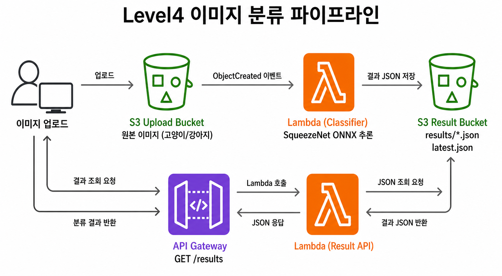

## Assignment: S3 이미지 업로드를 Lambda CNN 추론 파이프라인으로 처리하기

S3에 고양이/강아지 이미지를 업로드하면 Lambda가 실제 CNN 모델로 이미지를 분류하고, 결과 JSON을 다른 S3 버킷에 저장한다. 이후 API Gateway를 호출해 저장된 결과를 조회한다.



> [!NOTE]
> 이번 실습에서는 SqueezeNet ONNX 모델과 `onnxruntime`으로 실제 CNN 추론을 수행한다.

> [!IMPORTANT]
> 이번 실습 중에 사용되는 `onnxruntime`, `numpy`, `pillow`는 Lambda Layer에 넣고, SqueezeNet ONNX 모델은 함수 zip에 포함한다.

> [!IMPORTANT]
> **upload bucket과 result bucket 이름을 명확히 구분한다.** 원본 이미지 업로드 버킷과 결과 JSON 저장 버킷을 혼동하면 Lambda가 저장한 결과 때문에 다시 Lambda가 실행되는 **재귀 호출**이 발생할 수 있다.

## 0. 사전 준비

- AWS 계정 및 IAM 권한 (Lambda, S3, API Gateway, CloudWatch Logs, IAM)
- 로컬 터미널
- 제공된 classifier Lambda 코드: https://github.com/zero-uuuuk/KeulKeul/tree/main/assignment/week2-lambda/level4-image-classifier/classifier_lambda.py
- 제공된 result API Lambda 코드: https://github.com/zero-uuuuk/KeulKeul/tree/main/assignment/week2-lambda/level4-image-classifier/result_api_lambda.py
- 제공된 Layer dependency 목록: https://github.com/zero-uuuuk/KeulKeul/tree/main/assignment/week2-lambda/level4-image-classifier/requirements.txt

## 1. 전체 구조

이번 실습은 Lambda 함수를 2개 사용한다.

| Lambda | 실행 방식 | 역할 |
| --- | --- | --- |
| `keulkeul-week2-image-classifier` | S3 trigger | 업로드 이미지를 CNN으로 분류하고 결과 JSON 저장 |
| `keulkeul-week2-image-result-api` | API Gateway | 저장된 결과 JSON 조회 |

S3 버킷도 2개 사용한다.

| 버킷 | 역할 |
| --- | --- |
| upload bucket | 원본 이미지 업로드 |
| result bucket | 분류 결과 JSON 저장 |

흐름은 아래와 같다.

```text
이미지 업로드
→ S3 Event Notification
→ classifier Lambda
→ result bucket에 results/{원본 key}.json 저장
→ API Gateway GET /results
→ result API Lambda
→ 결과 JSON 반환
```

## 2. S3 버킷 생성

1. AWS 콘솔 → **S3** → **버킷 만들기** 클릭
2. upload bucket 생성
    - 이름 예시: `keulkeul-week2-image-upload-{본인이름}`
    - 퍼블릭 액세스 차단: 켬
3. result bucket 생성
    - 이름 예시: `keulkeul-week2-image-result-{본인이름}`
    - 퍼블릭 액세스 차단: 켬

## 3. Lambda Layer 만들기

`onnxruntime`, `numpy`, `pillow`는 Lambda 코드에 직접 붙여넣을 수 없으므로 Layer로 분리한다.

Lambda Layer 개념 참고: https://jibinary.tistory.com/entry/AWS-Lambda-Layer%EB%9E%80-%EC%89%BD%EA%B2%8C-%EC%A0%95%EB%A6%AC-Lambda%EC%97%90%EC%84%9C-%ED%95%84%EC%9A%94%ED%95%9C-%EB%9D%BC%EC%9D%B4%EB%B8%8C%EB%9F%AC%EB%A6%AC-%EC%82%AC%EC%9A%A9%ED%95%98%EA%B8%B0

1. 로컬 터미널 또는 CloudShell에서 `level4-image-classifier` 디렉토리로 이동

> [!IMPORTANT]
> 아래에서 실행하는 모든 로컬 명령어는 `level4-image-classifier` 디렉토리 안에서 실행한다.

2. Layer zip 생성

```bash
rm -rf python layer.zip
python3 -m pip install \
  --platform manylinux_2_28_x86_64 \
  --platform manylinux2014_x86_64 \
  --implementation cp \
  --python-version 3.12 \
  --abi cp312 \
  --only-binary=:all: \
  --no-compile \
  -r requirements.txt \
  -t python
zip -rq layer.zip python
```

<details>
<summary>명령어별 역할 보기</summary>

`wheel만 받는다`는 것은 Mac/Window에서 패키지를 직접 빌드하지 않고, Lambda Linux 환경에 맞게 미리 빌드된 완제품 패키지만 사용한다는 뜻이다.

- `rm -rf python layer.zip`: 이전에 만든 Layer 폴더와 zip 파일을 삭제해 깨끗한 상태에서 다시 만든다.
- `python3 -m pip install`: `requirements.txt`에 적힌 패키지를 설치한다.
- `--platform manylinux_2_28_x86_64`: `onnxruntime`이 제공하는 Linux x86_64 wheel을 받는다.
- `--platform manylinux2014_x86_64`: `numpy`가 제공하는 Linux x86_64 wheel을 받는다.
- `--implementation cp`: Lambda Python 런타임과 같은 CPython용 wheel을 받는다.
- `--python-version 3.12`: Lambda runtime과 같은 Python 3.12용 wheel을 받는다.
- `--abi cp312`: CPython 3.12 ABI와 맞는 wheel을 받는다.
- `--only-binary=:all:`: 소스 코드를 직접 빌드하지 않고 미리 빌드된 wheel만 사용한다.
- `--no-compile`: 로컬 Python 버전의 `.pyc` 파일을 만들지 않는다.
- `-r requirements.txt`: 설치할 패키지 목록을 `requirements.txt`에서 읽는다.
- `-t python`: Lambda Layer 규칙에 맞게 패키지를 `python/` 폴더에 설치한다.
- `zip -rq layer.zip python`: `python/` 폴더를 Lambda Layer로 업로드할 `layer.zip` 파일로 압축한다.

</details>

3. AWS 콘솔 → **Lambda** → **Layers** → **Create layer** 클릭
4. 설정값:
    - 이름: `keulkeul-week2-onnx-layer`
    - Upload a .zip file: `layer.zip`
    - Compatible architectures: `x86_64`
    - Compatible runtimes: `Python 3.12`
5. **Create** 클릭

## 4. 모델 다운로드

classifier Lambda zip에 넣을 SqueezeNet ONNX 모델을 다운로드한다.

```bash
curl -L -o squeezenet1.1-7.onnx https://github.com/onnx/models/raw/main/validated/vision/classification/squeezenet/model/squeezenet1.1-7.onnx
```

생성되는 파일:

```text
squeezenet1.1-7.onnx
```

> [!NOTE]
> SqueezeNet은 ImageNet 1000개 class를 분류하는 작은 CNN 모델이다. 이번 실습에서는 ImageNet의 고양이 class와 강아지 class를 `cat`, `dog`로 축약해서 사용한다.

## 5. classifier Lambda 생성

### 5-1. 배포 zip 만들기

`classifier_lambda.py`와 `squeezenet1.1-7.onnx`를 같은 zip에 넣는다.

```bash
zip classifier.zip classifier_lambda.py squeezenet1.1-7.onnx
```

### 5-2. 함수 생성

1. AWS 콘솔 → **Lambda** → **함수 생성** 클릭
2. 설정값:
    - 옵션: **새로 작성**
    - 함수 이름: `keulkeul-week2-image-classifier`
    - 런타임: `Python 3.12`
    - 아키텍처: `x86_64`
    - 권한: **기본 Lambda 권한을 가진 새 역할 생성**
3. **함수 생성** 클릭

### 5-3. 코드 업로드 및 설정

1. 함수 화면 → **코드** 탭 → **Upload from** → `.zip file`
2. `classifier.zip` 업로드

> [!NOTE]
> `.zip file`로 코드를 업로드하면 업로드 완료 시점에 자동으로 배포된다. 콘솔 코드 편집기에서 직접 수정할 때처럼 별도로 **Deploy**를 누르지 않아도 된다.

3. **Runtime settings** → Handler를 아래 값으로 수정

```text
classifier_lambda.lambda_handler
```

4. **Layers** → **Add a layer**
    - Custom layers
    - `keulkeul-week2-onnx-layer` 선택
5. **Configuration** → **General configuration** → **Edit**
    - Memory: `2048 MB`
    - Timeout: `30 seconds`
6. **Configuration** → **Environment variables** → **Edit**
    - `RESULT_BUCKET`: result bucket 이름

## 6. classifier Lambda 권한 추가

classifier Lambda 실행 역할에 S3 읽기/쓰기 권한을 추가한다.

> [!NOTE]
> 실행된 Lambda가 S3 객체를 읽고 결과 JSON을 저장하려면 별도의 실행 역할 권한이 필요하다.

1. Lambda 함수 → **Configuration** → **Permissions** 이동
2. Execution role 이름 클릭
3. IAM 콘솔에서 **Add permissions** → **Create inline policy**
4. JSON 탭에 아래 정책 입력
5. `{UPLOAD_BUCKET}`과 `{RESULT_BUCKET}`을 실제 버킷 이름으로 교체

```json
{
  "Version": "2012-10-17",
  "Statement": [
    {
      "Effect": "Allow",
      "Action": ["s3:GetObject"],
      "Resource": "arn:aws:s3:::{UPLOAD_BUCKET}/*"
    },
    {
      "Effect": "Allow",
      "Action": ["s3:PutObject"],
      "Resource": "arn:aws:s3:::{RESULT_BUCKET}/*"
    }
  ]
}
```
6. 정책 이름: `keulkeul-week2-image-classifier-s3-policy`

## 7. S3 trigger 연결

1. classifier Lambda 함수 화면 → **함수 개요** → **트리거 추가** 클릭
2. 설정값:
    - 소스: `S3`
    - 버킷: upload bucket
    - 이벤트 유형: `모든 객체 생성 이벤트`
    - Prefix: 비워둠
    - Suffix: `.jpg`
3. 재귀 호출 경고를 확인하고 체크
4. **추가** 클릭

> [!IMPORTANT]
> trigger는 upload bucket에만 연결한다. result bucket에 trigger를 연결하면 결과 JSON 저장이 다시 Lambda를 실행하는 재귀 호출 문제가 생길 수 있다.

> [!NOTE]
> `.png`도 테스트하고 싶으면 같은 방식으로 Suffix `.png` trigger를 하나 더 추가한다.

## 8. 이미지 업로드 및 결과 저장 확인

1. upload bucket에 고양이 또는 강아지 `.jpg` 이미지를 업로드
2. classifier Lambda → **모니터링** → **CloudWatch 로그 보기** 클릭
3. 아래 형태의 로그 확인

```text
이미지 분류 완료: source=s3://..., prediction=cat, result=s3://.../results/sample.jpg.json
```

4. result bucket에서 아래 파일 확인

```text
results/{업로드한 이미지 key}.json
latest.json
```

결과 JSON 예시:

```json
{
  "source_bucket": "keulkeul-week2-image-upload-...",
  "source_key": "cat.jpg",
  "result_key": "results/cat.jpg.json",
  "request_id": "00000000-0000-0000-0000-000000000000",
  "created_at": "2026-06-28T00:00:00+00:00",
  "prediction": "cat",
  "confidence": 0.812345,
  "top_class_id": 281,
  "top_class_name": "tabby",
  "model": "squeezenet1.1-7"
}
```

> [!NOTE]
> 모델은 ImageNet class를 기준으로 판단한다. 사진 품질, 배경, crop 상태에 따라 `unknown`이 나올 수 있다.

## 9. result API Lambda 생성

### 9-1. 배포 zip 만들기

```bash
zip result-api.zip result_api_lambda.py
```

### 9-2. 함수 생성

1. AWS 콘솔 → **Lambda** → **함수 생성** 클릭
2. 설정값:
    - 옵션: **새로 작성**
    - 함수 이름: `keulkeul-week2-image-result-api`
    - 런타임: `Python 3.12`
    - 아키텍처: `x86_64`
    - 권한: **기본 Lambda 권한을 가진 새 역할 생성**
3. **함수 생성** 클릭

### 9-3. 코드 업로드 및 설정

1. 함수 화면 → **코드** 탭 → **Upload from** → `.zip file`
2. `result-api.zip` 업로드

3. **Runtime settings** → Handler를 아래 값으로 수정

```text
result_api_lambda.lambda_handler
```

4. **Configuration** → **Environment variables** → **Edit**
    - `RESULT_BUCKET`: result bucket 이름

## 10. result API Lambda 권한 추가

result API Lambda 실행 역할에 result bucket 읽기 권한을 추가한다.

```json
{
  "Version": "2012-10-17",
  "Statement": [
    {
      "Effect": "Allow",
      "Action": ["s3:GetObject"],
      "Resource": "arn:aws:s3:::{RESULT_BUCKET}/*"
    }
  ]
}
```

정책 이름: `keulkeul-week2-image-result-api-s3-policy`

## 11. API Gateway 연결

1. AWS 콘솔 → **API Gateway** → **API 생성**
2. **HTTP API** 선택 후 **Build** 클릭
3. Integration 설정:
    - Integration type: `Lambda`
    - Lambda function: `keulkeul-week2-image-result-api`
4. API 이름: `keulkeul-week2-image-result-api`
5. Route 구성:

| Method | Path | Integration |
| --- | --- | --- |
| `GET` | `/results` | `keulkeul-week2-image-result-api` |

6. Stage는 `$default`, Auto-deploy는 켬
7. 생성 후 **Invoke URL** 복사

## 12. API로 결과 조회

최신 결과 조회:

```bash
curl "{API_ENDPOINT}/results"
```

특정 이미지 결과 조회:

```bash
curl "{API_ENDPOINT}/results?key=cat.jpg"
```

결과가 아직 없으면 `404` 응답이 온다. 이 경우 classifier Lambda 로그와 result bucket 저장 여부를 먼저 확인한다.

## 13. 실습 질문

아래 질문에 짧게 답한다.

1. 이번 파이프라인에서 비동기 처리와 동기 처리는 각각 어느 부분인가?
2. 모델과 dependency를 Lambda 코드에 모두 직접 넣지 않고 Layer를 사용한 이유는 무엇인가?
3. classifier Lambda 실행 역할에는 왜 `s3:GetObject`와 `s3:PutObject`가 모두 필요한가?
4. result bucket에 trigger를 연결하면 어떤 문제가 생길 수 있는가?
5. API Gateway가 직접 이미지를 분류하지 않고 result bucket의 JSON만 읽는 이유는 무엇인가?

## 14. 리소스 정리

실습 완료 후 아래 순서로 리소스를 삭제한다.

1. **S3 trigger 삭제**
    - classifier Lambda → **Configuration** → **Triggers**에서 S3 trigger 삭제

2. **API Gateway 삭제**
    - API Gateway 콘솔 → `keulkeul-week2-image-result-api` 삭제

3. **Lambda 함수 삭제**
    - `keulkeul-week2-image-classifier` 삭제
    - `keulkeul-week2-image-result-api` 삭제

4. **Lambda Layer 삭제**
    - Lambda → **Layers** → `keulkeul-week2-onnx-layer` 버전 삭제

5. **S3 객체 및 버킷 삭제**
    - upload bucket 비우기 후 삭제
    - result bucket 비우기 후 삭제

6. **CloudWatch Log Group 삭제**
    - `/aws/lambda/keulkeul-week2-image-classifier` 삭제
    - `/aws/lambda/keulkeul-week2-image-result-api` 삭제
