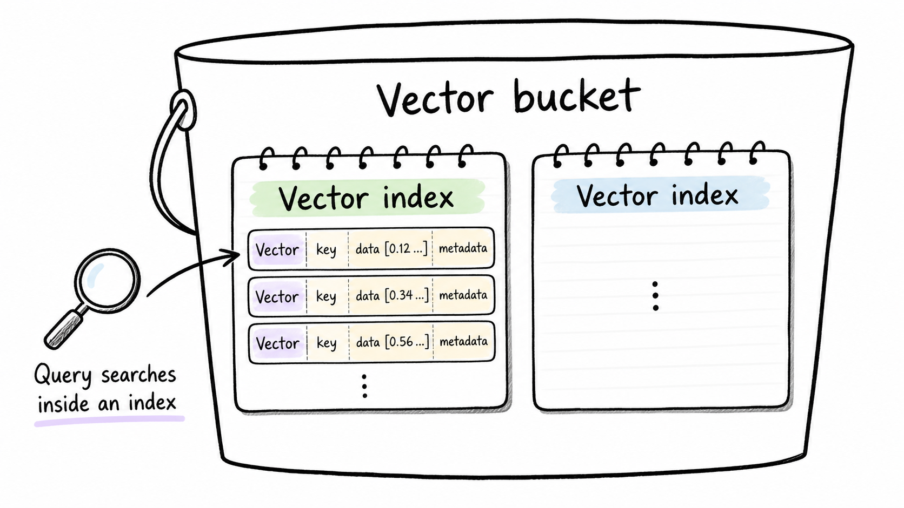

## Assignment: S3 Vectors로 로컬 RAG 구성하기

S3 Vectors를 vector store로 사용하고, Hugging Face embedding 모델은 로컬 PC에서 실행해 간단한 RAG(Retrieval-Augmented Generation) 검색 흐름을 구성한다.

참고 자료:
- https://docs.aws.amazon.com/AmazonS3/latest/userguide/s3-vectors.html
- https://docs.aws.amazon.com/AmazonS3/latest/userguide/s3-vectors-getting-started.html
- https://docs.aws.amazon.com/AmazonS3/latest/userguide/s3-vectors-limitations.html
- https://aws.amazon.com/s3/features/vectors/

> [!IMPORTANT]
> 이번 실습에서는 vector 저장 및 유사도 검색만 AWS S3 Vectors를 사용한다. embedding 모델과 LLM은 Hugging Face 모델로 로컬 PC에서 실행하고, vector 저장 및 검색은 CLI 터미널에서 Python 스크립트로 진행한다.

## 0. S3 Vectors 이해하기

### 0-1. Vector DB가 필요한 이유

일반적인 데이터베이스나 파일 저장소는 주로 정확히 같은 값이나 키워드를 찾는다. 예를 들어 `환불`이라는 단어가 포함된 문서를 찾는 식이다. 하지만 RAG나 semantic search에서는 질문과 문서의 단어가 완전히 같지 않아도, 의미가 비슷하면 검색되어야 한다.

예시:

```text
질문: 결제 취소는 며칠 안에 할 수 있나요?
문서: 환불 요청은 구매일로부터 7일 이내에 접수해야 합니다.
```

두 문장은 단어가 다르지만 의미는 가깝다. embedding 모델은 이런 문장을 숫자 배열인 vector로 바꾸고, Vector DB는 질문 vector와 가까운 문서 vector를 찾아준다. RAG에서는 이 검색 결과를 LLM의 context로 넣어 답변을 만든다.

이번 실습의 전체 흐름:

```text
로컬 문서
  → 로컬 embedding 모델
  → S3 Vectors에 저장
  → 질문을 로컬 embedding 모델로 변환
  → S3 Vectors에서 유사 문서 검색
  → 검색 결과를 로컬 LLM에 전달
  → 답변 생성
```

### 0-2. S3 Vectors란 무엇인가?

AWS 공식 문서에 따르면 S3 Vectors는 AI agents, inference, RAG, semantic search를 위한 비용 최적화 vector storage이다. 일반 S3처럼 탄력성, 내구성, 가용성을 목표로 하면서도, vector 데이터를 저장하고 조회하기 위한 전용 API를 제공한다.

S3 Vectors의 핵심 구성 요소는 세 가지다.



1. **Vector bucket**
    - 일반 S3 bucket과 다른 bucket 유형이다.
    - 객체 파일이 아니라 vector 데이터를 저장하고 query하기 위해 만들어졌다.
    - 이름은 리전 안에서 계정별로 고유해야 하며, 생성 후 변경할 수 없다.

2. **Vector index**
    - vector bucket 안에서 vector들을 논리적으로 묶는 검색 단위이다.
    - 유사도 검색은 vector index 안에서 수행된다.
    - index 생성 시 dimension, distance metric, non-filterable metadata key를 정한다.
    - dimension과 distance metric은 생성 후 변경할 수 없다.

3. **Vector**
    - embedding 모델이 만든 숫자 배열이다.
    - S3 Vectors에서는 vector key, vector data, metadata를 함께 저장할 수 있다.
    - metadata는 query 결과를 설명하거나 filter 조건으로 사용할 수 있다.

### 0-3. 일반 S3 bucket과 다른 점

일반 S3 bucket은 `index.html`, 이미지, PDF, 로그 파일 같은 object를 저장한다. 반면 S3 vector bucket은 embedding vector를 저장하고, `QueryVectors` API로 가장 가까운 vector를 검색한다.

| 구분 | 일반 S3 bucket | S3 vector bucket |
| --- | --- | --- |
| 주요 데이터 | 파일 object | embedding vector |
| 대표 작업 | upload, download, presigned URL, static website hosting | put vectors, query vectors |
| 검색 방식 | key prefix, object metadata, 별도 검색 서비스 필요 | vector similarity search |
| public 접근 | 설정에 따라 public object 가능 | Block Public Access가 항상 활성화되어 해제 불가 |
| API namespace | `s3` | `s3vectors` |

> [!IMPORTANT]
> S3 Vectors는 vector 전용 API로 저장 및 검색하며, vector bucket은 public access를 열 수 없다.
> 접근 제어는 일반 S3의 `s3:GetObject`가 아니라 `s3vectors:QueryVectors`, `s3vectors:PutVectors` 같은 S3 Vectors 전용 권한을 IAM 및 resource policy로 관리한다.

### 0-4. S3 Vectors의 검색 방식

S3 Vectors는 질문 vector와 저장된 vector 사이의 거리를 계산해 가장 가까운 결과를 반환한다. 공식 문서의 getting started 예제에서는 `PutVectors` API로 vector를 저장하고, `QueryVectors` API로 유사도 검색을 수행한다.

검색 시 사용할 수 있는 주요 옵션:

- `queryVector`: 질문을 embedding한 vector
- `topK`: 반환할 상위 결과 개수
- `returnDistance`: 결과마다 거리 값을 포함할지 여부
- `returnMetadata`: 저장한 metadata를 함께 받을지 여부
- `filter`: metadata 조건으로 결과 범위를 좁히는 조건

이번 실습에서는 `source_text` metadata에 원문을 저장하고, 검색 결과의 `source_text`를 LLM context로 전달한다.

### 0-5. S3 Vectors가 잘 맞는 상황

S3 Vectors는 모든 Vector DB를 대체하기보다, S3의 저장소 성격에 가까운 장점을 vector 검색에 가져온 서비스로 이해하면 좋다.

잘 맞는 예:

- 대량의 embedding을 오래 저장해야 하는 경우
- query 빈도는 높지 않지만, 필요할 때 semantic search가 필요한 경우
- RAG 지식 저장소를 저비용으로 운영하고 싶은 경우
- S3 데이터와 함께 AI 검색 기반을 만들고 싶은 경우
- Bedrock Knowledge Bases나 OpenSearch와 AWS 안에서 연동하고 싶은 경우

주의할 점:

- 고QPS, 초저지연 실시간 검색이 핵심인 서비스라면 OpenSearch, Pinecone 같은 전용 검색 계층이 더 적합할 수 있다.
- embedding dimension은 index 생성 후 바꿀 수 없으므로, 처음부터 사용할 embedding 모델을 정해야 한다.

## 1. 사전 준비

- AWS 계정 및 IAM 권한: S3 Vectors 콘솔 접근, vector bucket/index 생성, `s3vectors` 저장 및 검색 API 호출 권한
- Python 3.10 이상
- AWS CLI credential 설정 ([AWS CLI 설치 및 `aws configure` 설정 방법](https://inpa.tistory.com/entry/AWS-%F0%9F%93%9A-AWS-CLI-%EC%84%A4%EC%B9%98-%EC%82%AC%EC%9A%A9%EB%B2%95-%EC%89%BD%EA%B3%A0-%EB%B9%A0%EB%A5%B4%EA%B2%8C))
- 제공된 실행 스크립트: `assignment/week3-s3/level3-s3-vectors-rag/rag_local.py`
- 제공된 원본 데이터: `assignment/week3-s3/level3-s3-vectors-rag/rag_documents.json`

이번 실습에서 사용하는 기본 embedding 모델:

```text
sentence-transformers/paraphrase-multilingual-MiniLM-L12-v2
```

> [!NOTE]
> 이 모델은 Hugging Face `sentence-transformers` 기반의 다국어 embedding 모델이며, 384차원 vector를 반환한다. 첫 실행 때 모델 파일을 내려받고, 이후에는 로컬 캐시를 재사용한다.

이번 실습에서 사용하는 기본 LLM 모델:

```text
Qwen/Qwen2.5-1.5B-Instruct
```

### CLI 실행 준비

```bash
cd assignment/week3-s3/level3-s3-vectors-rag
python3 -m venv .venv
source .venv/bin/activate
python -m pip install -r requirements.txt
```

AWS credential 확인:

```bash
aws sts get-caller-identity
```

## 2. S3 vector bucket 생성

1. AWS 콘솔 → **S3**로 이동
2. 왼쪽 메뉴에서 **Vector buckets** 선택
3. **Create vector bucket** 클릭
4. 설정값:
    - Vector bucket name: 예: `keulkeul-week3-vectors-{본인이름}`
    - Encryption: 기본값
    - Tags: 선택
5. **Create vector bucket** 클릭

확인할 것:

- 일반 bucket 목록이 아니라 **Vector buckets** 목록에 생성되었는가?
- 생성 후 이름과 암호화 방식을 바꿀 수 없다는 점을 이해했는가?

## 3. Vector index 생성

1. 2장에서 만든 vector bucket 선택
2. **Create vector index** 클릭
3. 설정값:
    - Vector index name: `keulkeul-rag`
    - Dimension: `384`
    - Distance metric: `Cosine`
    - Non-filterable metadata key: `source_text`
    - Encryption: bucket 설정 사용
4. **Create vector index** 클릭

> [!IMPORTANT]
> `Dimension`은 embedding 모델이 반환하는 vector 길이와 반드시 같아야 한다. 이번 실습에서 사용하는 `sentence-transformers/paraphrase-multilingual-MiniLM-L12-v2`는 384차원 embedding을 기준으로 한다. 다른 embedding 모델을 사용하면 먼저 embedding 길이를 확인한 뒤 index dimension을 맞춘다.

확인할 것:

- index 이름이 `keulkeul-rag`인가?
- dimension이 embedding 모델과 일치하는가?
- distance metric을 왜 `Cosine`으로 선택했는가?
- `source_text`를 filter 조건에는 쓰지 않고, 검색 결과 원문으로만 사용할 계획인가?

## 4. 환경 변수 설정

터미널에서 S3 Vectors와 Hugging Face embedding 모델 설정을 환경 변수로 지정한다.

```bash
export AWS_REGION="{본인리전}"
export S3_VECTOR_BUCKET="keulkeul-week3-vectors-{본인이름}"
export S3_VECTOR_INDEX="keulkeul-rag"
export HF_EMBED_MODEL="sentence-transformers/paraphrase-multilingual-MiniLM-L12-v2"
export HF_LLM_MODEL="Qwen/Qwen2.5-1.5B-Instruct"
```

## 5. 문서 embedding 후 S3 Vectors에 저장

제공된 `rag_documents.json`은 긴 실습 문서 2개를 포함한다. `ingest` 명령은 다음 일을 수행한다.

1. `rag_documents.json`에서 문서 2개를 읽는다.
2. 문서 text를 Hugging Face `sentence-transformers` embedding 모델에 전달한다.
3. 반환된 embedding 숫자 배열을 `key`, `data`, `metadata`를 가진 저장 형식으로 감싼다.
4. `PutVectors` API로 vector index에 저장한다.
5. 각 vector에 `category`, `source_text` metadata를 저장한다.

실행:

```bash
python rag_local.py ingest
```

예상 출력:

```text
2개 문서를 S3 Vectors에 저장했다.
```

저장된 vector 목록 확인:

```bash
aws s3vectors list-vectors \
  --vector-bucket-name "$S3_VECTOR_BUCKET" \
  --index-name "$S3_VECTOR_INDEX" \
  --return-metadata
```

확인할 것:

- `s3-vectors-core`, `local-rag-flow` key가 보이는가?
- embedding은 로컬 PC에서 만들고, vector 저장소만 S3 Vectors를 사용했다는 점을 이해했는가?
- 같은 문서를 다시 ingest하면 같은 key의 vector가 갱신될 수 있다는 점을 이해했는가?

## 6. 질문으로 유사 문서 검색 후 답변 생성

`ask` 명령은 다음 일을 수행한다.

1. 질문을 로컬 embedding 모델로 vector 변환
2. `QueryVectors` API로 S3 Vectors에서 가까운 문서 검색
3. 검색된 `source_text`들을 LLM prompt context로 구성
4. Hugging Face 로컬 LLM에 context와 질문을 전달해 답변 생성

실행:

```bash
python rag_local.py ask "S3 Vectors는 일반 S3랑 뭐가 달라?"
```

확인할 것:

- `[검색 문맥]`에 질문과 관련된 문서가 먼저 출력되는가?
- `[LLM 답변]`이 검색 문맥을 근거로 생성되는가?
- 질문 단어와 문서 단어가 완전히 같지 않아도 의미가 가까운 문서가 검색되는가?

## 7. Metadata filter 실험

`rag_local.py` 기본 명령에는 filter 옵션을 넣지 않았다. 코드를 직접 수정해 `QueryVectors` 호출에 filter를 추가해본다.

예시:

```python
filter={"category": "s3"}
```

확인할 것:

- `category`가 `s3`인 문서 안에서만 유사도 검색이 수행되는가?
- filter는 keyword search가 아니라 vector search의 후보 범위를 좁히는 역할이라는 점을 이해했는가?
- `source_text`는 non-filterable metadata key로 만들었으므로 filter 조건에 쓰지 않는가?

## 8. 실습 질문

아래 질문에 짧게 답한다.

1. S3 Vectors에서 vector bucket, vector index, vector는 각각 어떤 역할을 하는가?
2. 이번 실습에서 embedding과 LLM은 어디에서 실행되고, S3 Vectors는 어떤 역할만 담당하는가?
3. RAG에서 vector similarity search가 필요한 이유는 무엇인가?
4. index dimension을 embedding 모델의 출력 dimension과 맞추지 않으면 어떤 문제가 생기는가?
5. `source_text`를 vector metadata에 저장하는 이유는 무엇인가?
6. S3 Vectors의 Block Public Access를 해제할 수 없다는 점은 어떤 보안 의미를 가지는가?

## 9. 기존 Vector DB와 S3 Vectors 비교

> [!NOTE]
> S3 Vectors의 Latency 분석에 대한 자세한 내용은 다음 글을 참고:
> - [AWS S3 Vectors Latency Analysis](https://murraycole.com/posts/aws-s3-vectors-latency-analysis)

| 항목 | S3 Vectors | Pinecone 같은 managed Vector DB | OpenSearch vector search | PostgreSQL + pgvector |
| --- | --- | --- | --- | --- |
| 기본 성격 | S3 계열의 비용 최적화 vector storage | vector search 전용 managed database | 검색 엔진에 vector search를 결합 | 관계형 DB에 vector 타입과 index 확장 |
| 운영 부담 | 인프라 프로비저닝 없이 vector bucket/index 사용 | managed 서비스라 낮음 | cluster/index 운영 개념 필요 | PostgreSQL 운영 필요 |
| 강점 | 대량 vector 장기 저장, 낮은 비용, AWS 통합 | 실시간 vector search 제품 기능, 개발자 경험 | hybrid search, aggregation, faceting, 검색 기능 | SQL 데이터와 embedding을 함께 다루기 쉬움 |
| 적합한 query 패턴 | 빈도가 낮거나 중간 정도인 semantic search | 사용자 요청이 많은 online search | 검색, 필터, 집계가 복합적인 서비스 | 기존 DB 중심의 소규모 또는 중간 규모 RAG |
| 고QPS/초저지연 | 주력 목적은 아님 | 상대적으로 적합 | OpenSearch 구성이 적합할 수 있음 | DB 규모와 index 설계에 크게 의존 |
| metadata filter | 지원 | 지원 | 강력한 filter/search 조합 지원 | SQL WHERE와 조합 가능 |
| AWS 통합 | Bedrock Knowledge Bases, OpenSearch, S3 생태계와 자연스럽게 연동 | AWS 외부 서비스 또는 별도 연동 필요 | AWS OpenSearch 및 로그/검색 생태계와 연동 | 애플리케이션 DB와 직접 통합 |
| public 접근 | vector bucket의 Block Public Access가 항상 켜짐 | 서비스별 API key 및 네트워크 정책 | IAM, VPC, fine-grained access control 등 | DB 계정, 네트워크, RLS 등으로 제어 |
| 이번 실습에서의 역할 | vector 저장 및 유사도 검색 | 사용하지 않음 | 사용하지 않음 | 사용하지 않음 |

정리하면, S3 Vectors는 “파일 저장소 S3가 vector 검색까지 한다”에 가깝다. Pinecone 같은 기존 Vector DB는 “vector search를 중심으로 설계된 데이터베이스”에 가깝다. 대량의 embedding을 비용 효율적으로 오래 보관하고 필요할 때 검색하는 목적이라면 S3 Vectors가 잘 맞고, 높은 QPS와 복잡한 검색 기능이 핵심인 서비스라면 전용 Vector DB나 OpenSearch를 함께 검토한다.

## 10. 리소스 정리

실습 완료 후 아래 순서로 리소스를 삭제한다.

1. **Vector index 삭제**
    - S3 → Vector buckets → 실습 bucket 선택
    - `keulkeul-rag` vector index 삭제

2. **Vector bucket 삭제**
    - 실습용 vector bucket 삭제

3. **로컬 모델 캐시 정리**
    - Hugging Face 모델 캐시는 재사용할 수 있으므로 보통 삭제하지 않아도 된다.
