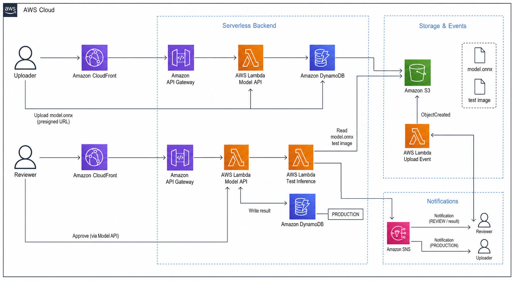

## Assignment: AI 모델 버전 관리·배포 승인 웹 만들기

ResNet ONNX 모델 artifact를 S3에 업로드하고, Reviewer가 테스트 추론 결과를 확인한 뒤 운영 모델로 승인하는 서버리스 웹을 직접 만든다.

참고 자료:
- CloudFront: https://inpa.tistory.com/entry/AWS-%F0%9F%93%9A-CloudFront-%EA%B0%9C%EB%85%90-%EC%9B%90%EB%A6%AC-%EC%82%AC%EC%9A%A9-%EC%84%B8%ED%8C%85-%F0%9F%92%AF-%EC%A0%95%EB%A6%AC
- SNS: https://jibinary.tistory.com/entry/AWS-Amazon-SNS-%EC%89%BD%EA%B2%8C-%EA%B0%9C%EB%85%90%EA%B3%BC-%ED%8A%B9%EC%A7%95-%EC%A0%95%EB%A6%AC-Simple-Notification-Service

> [!IMPORTANT]
> 모델 artifact 같은 큰 파일은 API Gateway나 Lambda로 직접 보내지 않는다. API Lambda는 S3 Presigned URL만 발급하고, Uploader가 웹에서 S3에 직접 업로드한다.

## 0. 전체 흐름 이해하기

### 0-1. 사용자 흐름

Uploader는 모델 후보를 등록하고 ONNX 모델 artifact를 업로드한다.

```text
1. 웹에서 모델 이름, 버전, Accuracy, model.onnx 선택
2. POST /models/upload-url 호출
3. API Lambda가 DynamoDB에 PENDING_UPLOAD item 저장
4. API Lambda가 S3 Presigned URL 반환
5. Uploader가 웹에서 model.onnx를 S3에 직접 PUT
6. S3 ObjectCreated 이벤트 발생
7. Upload Event Lambda가 상태를 REVIEW로 변경 -> Lambda가 SNS Topic에 publish
8. SNS가 Reviewer에게 검토 알림 발송
```

Reviewer는 모델 후보를 검토하고 승인한다.

```text
1. 웹에서 모델 목록 조회
2. REVIEW 상태 모델에 테스트 이미지 선택
3. 테스트 추론 버튼 클릭
4. 웹이 테스트 이미지를 S3에 업로드
5. API Lambda가 Test Inference Lambda 호출
6. Test Inference Lambda가 `model.onnx`와 테스트 이미지로 추론 실행
7. 추론 결과가 DynamoDB에 저장됨
8. Production 승인 버튼 클릭
9. 상태가 PRODUCTION으로 변경됨 -> Lambda가 SNS Topic에 publish
10. SNS가 Uploader에게 승인 알림 발송
```

전체 서버리스 아키텍처:



### 0-2. 상태 흐름

| 상태 | 의미 |
| --- | --- |
| `PENDING_UPLOAD` | 모델 metadata만 등록되고 ONNX 모델 artifact는 아직 S3에 없는 상태 |
| `REVIEW` | ONNX 모델 artifact 업로드가 끝나 Reviewer 검토가 필요한 상태 |
| `PRODUCTION` | Reviewer가 운영 모델로 승인한 상태 |

### 0-3. API 역할

| API | 역할 |
| --- | --- |
| `POST /models/upload-url` | 모델 metadata를 등록하고 `model.onnx` 업로드용 Presigned URL을 발급한다. |
| `GET /models` | DynamoDB에 저장된 모델 후보 목록과 현재 상태를 조회한다. |
| `POST /models/{modelId}/test-image-url` | 테스트 이미지 업로드용 Presigned URL을 발급한다. |
| `POST /models/{modelId}/test-inference` | 테스트 이미지로 추론을 실행하고 `lastTestResult`를 갱신한다. |
| `PATCH /models/{modelId}/status` | 테스트가 끝난 `REVIEW` 모델을 `PRODUCTION` 상태로 승인한다. |

### 0-4. Lambda별 역할

| Lambda | 호출 주체 | 역할 |
| --- | --- | --- |
| `keulkeul-model-api` | API Gateway | 모델 등록, 목록 조회, 테스트 이미지 URL 발급, 테스트 추론 요청, Production 승인 API를 처리한다. |
| `keulkeul-model-upload-event` | S3 ObjectCreated event | `model.onnx` 업로드 완료를 감지해 DynamoDB 상태를 `REVIEW`로 바꾸고 Reviewer에게 SNS 알림을 보낸다. |
| `keulkeul-model-test-inference` | API Lambda | S3의 `model.onnx`와 테스트 이미지를 내려받아 ONNX Runtime으로 추론하고 category, confidence, latency를 반환한다. |

## 1. 사전 준비

필요한 것:
- Uploader 이메일 주소: 모델 후보를 등록하고, 승인 완료 알림을 받을 이메일
- Reviewer 이메일 주소: 모델 검토 요청 알림을 받고 Production 승인을 처리할 이메일
- 제공된 Lambda 코드: [`lambda/model_api.py`](./lambda/model_api.py), [`lambda/upload_event.py`](./lambda/upload_event.py), [`lambda/test_inference.py`](./lambda/test_inference.py)
- 제공된 ImageNet category 파일: [`lambda/imagenet_classes.txt`](./lambda/imagenet_classes.txt)
- 제공된 웹 코드: [`web/app`](./web/app)
- S3에 업로드할 ONNX 모델 (`ResNet`) 파일: [`model.onnx`](./model.onnx)
- 테스트 이미지 파일: 컵, 자동차, 노트북처럼 사물이 하나만 크게 보이는 JPG 파일을 `test.jpg` 이름으로 준비
- Linux 터미널 환경 (**Ubuntu 강력 권장**)

## 2. S3 Model Bucket 만들기

ONNX 모델 파일을 저장할 S3 bucket을 만든다.

1. AWS 콘솔 → **S3**로 이동
2. **Create bucket** 클릭
3. 설정값 입력
    - Bucket name: `keulkeul-model-artifacts-{본인이름}`
    - AWS Region: 본인 실습 리전
    - Object Ownership: 기본값
    - Block Public Access: 기본값
    - Bucket Versioning: 기본값
    - Default encryption: 기본값
4. **Create bucket** 클릭

Uploader가 웹에서 Presigned URL로 파일을 업로드할 수 있도록 CORS를 설정한다.

1. 방금 만든 bucket 선택
2. **Permissions** 탭 선택
3. **Cross-origin resource sharing (CORS)** 편집
4. 아래 JSON 입력 후 저장

```json
[
  {
    "AllowedHeaders": ["*"],
    "AllowedMethods": ["PUT"],
    "AllowedOrigins": ["*"],
    "ExposeHeaders": ["ETag"],
    "MaxAgeSeconds": 3000
  }
]
```
> [!NOTE]
> 이후 12장에서 CloudFront domain을 만든 뒤 `AllowedOrigins`을 CloudFront domain으로 제한한다.

## 3. DynamoDB Table 만들기

모델 metadata와 상태를 저장할 DynamoDB table을 만든다.

1. AWS 콘솔 → **DynamoDB**로 이동
2. **Create table** 클릭
3. 설정값 입력
    - Table name: `keulkeul-model-registry`
    - Partition key: `modelId`
    - Partition key type: `String`
    - Table settings: `Default settings`
    - Capacity mode: `On-demand`
4. **Create table** 클릭

<details>
<summary>추후 생성될 DynamoDB item 예시 보기</summary>

```jsonc
{
  "modelId": "resnet18-image-classifier-v1", // DynamoDB partition key
  "modelName": "resnet18-image-classifier", // 모델 이름
  "version": "v1", // 모델 버전
  "artifactKey": "models/resnet18-image-classifier/v1/model.onnx", // S3 object key
  "accuracy": 0.69758, // Uploader가 입력한 검증 accuracy
  "status": "REVIEW", // 현재 승인 상태
  "lastTestResult": { // 마지막 테스트 이미지 추론 결과
    "imageKey": "test-images/resnet18-image-classifier-v1/test.jpg", // 테스트 이미지 S3 object key
    "predictedLabel": "banana", // 예측 ImageNet category 이름
    "classIndex": 954, // ONNX 출력 vector에서 가장 확률이 높은 index
    "confidence": 0.1842, // softmax 최대 확률
    "latencyMs": 96 // 추론 실행 시간
  },
  "createdAt": "2026-07-27T16:00:00+09:00", // item 생성 시각
  "updatedAt": "2026-07-27T16:10:00+09:00" // 마지막 수정 시각
}
```

</details>

## 4. SNS Topic 만들기

모델 검토 요청과 Production 승인 완료 알림을 분리하기 위해 SNS topic을 두 개 만든다.

| Topic | 구독 이메일 | 발송 시점 |
| --- | --- | --- |
| `keulkeul-model-review-topic` | Reviewer 이메일 | ONNX 모델 artifact 업로드 완료 후 검토 요청 |
| `keulkeul-model-approval-topic` | Uploader 이메일 | Reviewer가 Production 승인한 뒤 |

### 4-1. Topic 생성

1. AWS 콘솔 → **SNS**로 이동
2. **Topics** → **Create topic** 클릭
3. 설정값 입력
    - Type: `Standard`
    - Name: `keulkeul-model-review-topic`
4. **Create topic** 클릭
5. 생성된 review topic ARN을 메모한다.
6. 같은 방식으로 `keulkeul-model-approval-topic`도 생성하고 approval topic ARN을 메모한다.

### 4-2. Reviewer 이메일 구독

1. `keulkeul-model-review-topic` 화면에서 **Create subscription** 클릭
2. 설정값 입력
    - Protocol: `Email`
    - Endpoint: Reviewer 이메일 주소
3. **Create subscription** 클릭
4. Reviewer 이메일함에서 AWS 확인 메일을 연다.
5. **Confirm subscription** 클릭

### 4-3. Uploader 이메일 구독

1. `keulkeul-model-approval-topic` 화면에서 **Create subscription** 클릭
2. 설정값 입력
    - Protocol: `Email`
    - Endpoint: Uploader 이메일 주소
3. **Create subscription** 클릭
4. Uploader 이메일함에서 AWS 확인 메일을 연다.
5. **Confirm subscription** 클릭

> [!IMPORTANT]
> 각 이메일 주소가 SNS Topic 구독을 확인해야 메일을 받을 수 있다. 구독 확인 전에는 Lambda가 SNS Topic에 메시지를 발행해도 메일이 도착하지 않는다.

## 5. Lambda 실행 Role 만들기

실습을 단순하게 하기 위해 세 Lambda가 하나의 실행 role을 공유한다.

> [!NOTE]
> 운영 환경에서는 API Lambda, Upload Event Lambda, Test Inference Lambda의 role을 분리하고 필요한 권한만 각각 부여한다.

### 5-1. Role 생성

1. AWS 콘솔 → **IAM** → **Roles**로 이동
2. **Create role** 클릭
3. Trusted entity type: `AWS service`
4. Use case: `Lambda`
5. Permission policies에서 `AWSLambdaBasicExecutionRole` 선택
6. Role name: `keulkeul-model-lambda-role`
7. **Create role** 클릭

### 5-2. Inline policy 추가

1. `keulkeul-model-lambda-role` 선택
2. **Add permissions** → **Create inline policy** 클릭
3. **JSON** 탭 선택
4. 아래 JSON에서 `{REGION}`, `{ACCOUNT_ID}`, `{MODEL_BUCKET}`을 본인 값으로 바꿔 입력

```json
{
  "Version": "2012-10-17",
  "Statement": [
    {
      "Effect": "Allow",
      "Action": [
        "dynamodb:PutItem",
        "dynamodb:GetItem",
        "dynamodb:Scan",
        "dynamodb:UpdateItem"
      ],
      "Resource": "arn:aws:dynamodb:{REGION}:{ACCOUNT_ID}:table/keulkeul-model-registry"
    },
    {
      "Effect": "Allow",
      "Action": [
        "s3:PutObject",
        "s3:GetObject"
      ],
      "Resource": [
        "arn:aws:s3:::{MODEL_BUCKET}/models/*",
        "arn:aws:s3:::{MODEL_BUCKET}/test-images/*"
      ]
    },
    {
      "Effect": "Allow",
      "Action": [
        "sns:Publish"
      ],
      "Resource": [
        "arn:aws:sns:{REGION}:{ACCOUNT_ID}:keulkeul-model-review-topic",
        "arn:aws:sns:{REGION}:{ACCOUNT_ID}:keulkeul-model-approval-topic"
      ]
    },
    {
      "Effect": "Allow",
      "Action": [
        "lambda:InvokeFunction"
      ],
      "Resource": "arn:aws:lambda:{REGION}:{ACCOUNT_ID}:function:keulkeul-model-test-inference"
    }
  ]
}
```

5. Policy name: `keulkeul-model-registry-inline`
6. **Create policy** 클릭

## 6. Test Inference Lambda 만들기

Test Inference Lambda는 S3에 저장된 `model.onnx`와 Reviewer가 업로드한 테스트 이미지를 내려받고, ONNX Runtime으로 실제 이미지 추론을 실행한다. ONNX 모델 출력은 1000차원 점수 vector이므로, 가장 높은 index를 [`lambda/imagenet_classes.txt`](./lambda/imagenet_classes.txt)의 ImageNet category 이름으로 바꿔 반환한다.

> [!IMPORTANT]
> Lambda 기본 Python runtime에는 `onnxruntime`, `numpy`, `pillow`가 포함되어 있지 않다. 이 의존성을 Lambda layer로 추가한다.
> Layer 안의 패키지는 반드시 Lambda 실행 환경과 맞아야 한다. 이번 실습 기준은 **Python 3.12 + Linux x86_64**이다.

### 6-1. 관련 파일 확인

관련 파일: [`lambda/test_inference.py`](./lambda/test_inference.py), [`lambda/imagenet_classes.txt`](./lambda/imagenet_classes.txt), [`lambda/requirements-test-layer.txt`](./lambda/requirements-test-layer.txt)

### 6-2. ONNX Runtime layer zip 만들기

```bash
# 이전에 만든 layer 폴더와 zip이 있으면 지운다.
rm -rf python onnxruntime-layer.zip

# -r: 설치할 패키지 목록 파일을 지정한다.
# --platform: Lambda Python 3.12 런타임이 사용하는 Linux 패키지 형식을 지정한다.
# --implementation: CPython용 패키지를 사용한다.
# --python-version: Lambda runtime과 같은 Python 3.12용 패키지를 사용한다.
# --only-binary: 소스 빌드 없이 이미 빌드된 패키지만 사용한다.
# -t: Lambda layer 규칙에 맞게 python/ 폴더에 설치한다.
python -m pip install \
  -r lambda/requirements-test-layer.txt \
  --platform manylinux_2_28_x86_64 \
  --implementation cp \
  --python-version 3.12 \
  --only-binary=:all: \
  -t python/

# python/ 폴더를 Lambda layer로 업로드할 zip 파일로 묶는다.
zip -r onnxruntime-layer.zip python/
```

### 6-3. Layer 생성

1. AWS 콘솔 → **Lambda** → **Layers**로 이동
2. **Create layer** 클릭
3. 설정값 입력
    - Name: `keulkeul-onnxruntime-layer`
    - Upload: `onnxruntime-layer.zip`
    - Compatible architectures: `x86_64`
    - Compatible runtimes: `Python 3.12`
4. **Create** 클릭

### 6-4. Lambda 함수 생성

1. AWS 콘솔 → **Lambda**로 이동
2. **Create function** 클릭
3. 설정값 입력
    - Function name: `keulkeul-model-test-inference`
    - Runtime: `Python 3.12`
    - Architecture: `x86_64`
    - Execution role: `Use an existing role`
    - Existing role: `keulkeul-model-lambda-role`
4. **Create function** 클릭
5. **Configuration** → **General configuration** → **Edit** 클릭
6. 설정값 변경
    - Memory: `1024 MB`
    - Timeout: `30 seconds`
7. 저장

### 6-5. Lambda 코드와 layer 연결

8. [`lambda/test_inference.py`](./lambda/test_inference.py), [`lambda/imagenet_classes.txt`](./lambda/imagenet_classes.txt)를 `test-inference.zip`으로 압축
9. **Code** 탭 → **Upload from** → `.zip file` 선택
10. `test-inference.zip` 업로드
11. **Layers** → **Add a layer** 클릭
12. Custom layers에서 `keulkeul-onnxruntime-layer` 선택 후 추가

## 7. API Lambda 만들기

API Gateway 뒤에서 모델 등록, 목록 조회, 테스트 추론, Production 승인을 처리할 Lambda를 만든다.

### 7-1. Lambda 함수 생성

1. Lambda → **Create function** 클릭
2. 설정값 입력
    - Function name: `keulkeul-model-api`
    - Runtime: `Python 3.12` 
    - Execution role: `keulkeul-model-lambda-role`
3. **Create function** 클릭
4. **Configuration** → **General configuration** → **Edit** 클릭
5. 설정값 변경
    - Memory: `512 MB`
    - Timeout: `30 seconds`
6. 저장

### 7-2. 환경 변수 추가

| Key | Value |
| --- | --- |
| `TABLE_NAME` | `keulkeul-model-registry` |
| `MODEL_BUCKET` | `keulkeul-model-artifacts-{본인이름}` |
| `APPROVAL_TOPIC_ARN` | 4장에서 메모한 approval topic ARN |
| `TEST_FUNCTION_NAME` | `keulkeul-model-test-inference` |

### 7-3. 코드 배포

`lambda_function.py`를 [`lambda/model_api.py`](./lambda/model_api.py) 파일 내용으로 교체한 뒤 **Deploy**를 클릭한다.

## 8. Upload Event Lambda 만들기

S3에 ONNX 모델 artifact가 올라오면 모델 상태를 `REVIEW`로 바꾸는 Lambda를 만든다.

### 8-1. Lambda 함수 생성

1. Lambda → **Create function** 클릭
2. 설정값 입력
    - Function name: `keulkeul-model-upload-event`
    - Runtime: `Python 3.12`
    - Execution role: `keulkeul-model-lambda-role`
3. **Create function** 클릭
4. **Configuration** → **General configuration** → **Edit** 클릭
5. 설정값 변경
    - Memory: `256 MB`
    - Timeout: `10 seconds`
6. 저장

### 8-2. 환경 변수 추가

| Key | Value |
| --- | --- |
| `TABLE_NAME` | `keulkeul-model-registry` |
| `REVIEW_TOPIC_ARN` | 4장에서 메모한 review topic ARN |

### 8-3. 코드 배포

`lambda_function.py`를 [`lambda/upload_event.py`](./lambda/upload_event.py) 파일 내용으로 교체한 뒤 **Deploy**를 클릭한다.

### 8-4. S3 trigger 연결

1. `keulkeul-model-upload-event` Lambda 화면으로 이동
2. **Add trigger** 클릭
3. Source: `S3`
4. Bucket: `keulkeul-model-artifacts-{본인이름}`
5. Event types: `All object create events`
6. Prefix: `models/`
7. Suffix: `.onnx`
8. Recursive invocation 경고를 확인하고 체크
9. **Add** 클릭

## 9. API Gateway 만들기

웹 앱과 `curl`이 API Lambda를 호출할 수 있도록 HTTP API를 만든다.

### 9-1. HTTP API 생성

1. AWS 콘솔 → **API Gateway**로 이동
2. **Create API** 클릭
3. **HTTP API** 선택
4. Integrations에서 **Lambda** 선택
5. Lambda function: `keulkeul-model-api`
6. API name: `keulkeul-model-registry-api`
7. Configure routes에서 아래 route 추가

### 9-2. Route 추가

| Method | Path |
| --- | --- |
| `POST` | `/models/upload-url` |
| `GET` | `/models` |
| `POST` | `/models/{modelId}/test-image-url` |
| `POST` | `/models/{modelId}/test-inference` |
| `PATCH` | `/models/{modelId}/status` |

8. 각 route의 integration을 `keulkeul-model-api`로 설정
9. Stage는 `$default`, Auto-deploy는 enabled 유지
10. **Create** 클릭

### 9-3. CORS 설정

1. 생성한 API 선택
2. **CORS** 메뉴 선택
3. 설정값 입력
    - Access-Control-Allow-Origin: `*`
    - Access-Control-Allow-Headers: `content-type`
    - Access-Control-Allow-Methods: `GET`, `POST`, `PATCH`, `OPTIONS`
4. 저장

### 9-4. Invoke URL 메모

API invoke URL을 메모한다. `예: https://abc123xyz.execute-api.ap-northeast-2.amazonaws.com`

## 10. 정적 웹 만들기

브라우저에서 모델 등록, ONNX 업로드, 테스트 이미지 업로드, 테스트 추론, Production 승인을 처리할 React + Vite CSR 앱을 준비한다.

### 10-1. 웹 앱 폴더로 이동

앱 폴더로 이동한다.

```bash
cd web/app
```

제공된 React + Vite 앱: [`web/app`](./web/app)

확인할 파일:

- [`web/app/src/main.jsx`](./web/app/src/main.jsx)
- [`web/app/src/styles.css`](./web/app/src/styles.css)
- [`web/app/package.json`](./web/app/package.json)

### 10-2. API URL 연결

`src/main.jsx` 파일에서 `API_BASE` 값을 9장에서 메모한 API invoke URL로 변경한다.

```text
const API_BASE = "https://{본인_API_ID}.execute-api.{REGION}.amazonaws.com";
```

### 10-3. 로컬에서 화면 확인

로컬에서 실행해 화면을 확인한다.

```bash
npm install
npm run dev
```

브라우저에서 Vite가 출력한 local URL을 연다.

### 10-4. 정적 파일 빌드

S3에 업로드할 정적 파일을 빌드한다.

```bash
npm run build
```

생성되는 폴더: `web/app/dist`

> [!IMPORTANT]
> `API_BASE` 값을 수정한 뒤에는 반드시 `npm run build`를 다시 실행한다. S3에는 build 결과물인 `dist/` 안의 파일만 올린다.

### 10-5. Static Web Bucket 만들기

정적 웹 bucket을 만든다.

1. S3 → **Create bucket** 클릭
2. Bucket name: `keulkeul-model-web-{본인이름}`
3. Region: 실습 리전
4. **Block all public access** 체크 해제
5. 경고 확인 체크
6. **Create bucket** 클릭

### 10-6. Static website hosting 켜기

1. Static web bucket 선택
2. **Properties** 탭
3. **Static website hosting** 편집
4. Enable 선택
5. Index document: `index.html`
6. Error document: `index.html`
7. 저장

### 10-7. Bucket policy 추가

1. **Permissions** 탭
2. **Bucket policy** 편집
3. `{WEB_BUCKET}`을 본인 static web bucket 이름으로 바꿔 입력

```json
{
  "Version": "2012-10-17",
  "Statement": [
    {
      "Sid": "PublicReadForLabWebsite",
      "Effect": "Allow",
      "Principal": "*",
      "Action": "s3:GetObject",
      "Resource": "arn:aws:s3:::{WEB_BUCKET}/*"
    }
  ]
}
```

### 10-8. Build 결과물 업로드

Vite build 결과물을 업로드한다.

1. Static web bucket → **Objects** 탭
2. **Upload** 클릭
3. `web/app/dist/` 폴더 안의 `index.html`과 `assets/` 폴더 업로드
4. Properties 탭의 **Bucket website endpoint**를 메모

## 11. CloudFront 연결하기

정적 웹 bucket에 올린 React 앱을 CloudFront에 연결한다. 이번 실습의 최종 접속 URL은 CloudFront domain이다.

### 11-1. Distribution 생성

1. AWS 콘솔 → **CloudFront** 이동
2. **Create distribution** 클릭
3. Origin domain 입력
    - 10장에서 메모한 static web bucket의 **Bucket website endpoint**에서 `http://`를 제외한 domain 입력
    - 예: `keulkeul-model-web-gildong.s3-website.ap-northeast-2.amazonaws.com`
4. Origin protocol: `HTTP only`
5. Viewer protocol policy: `Redirect HTTP to HTTPS`
6. Allowed HTTP methods: `GET, HEAD`
7. Default root object: `index.html`
8. **Create distribution** 클릭
9. Status가 `Deployed`가 될 때까지 기다림
10. Distribution domain name을 메모
    - 예: `https://d1234abcd.cloudfront.net`

> [!NOTE]
> 이번 실습에서는 S3 static website endpoint를 CloudFront origin으로 사용한다. 운영 환경에서는 S3 bucket을 public으로 열기보다 CloudFront Origin Access Control을 사용해 CloudFront만 S3 object를 읽게 만드는 구성이 더 안전하다.

### 11-2. Model Bucket CORS 제한

1. AWS 콘솔 → **S3** 이동
2. `keulkeul-model-artifacts-{본인이름}` bucket 선택
3. **Permissions** 탭 선택
4. **Cross-origin resource sharing (CORS)** 편집
5. `{CLOUDFRONT_DOMAIN}`을 11장에서 메모한 CloudFront domain으로 바꿔 입력

```json
[
  {
    "AllowedHeaders": ["*"],
    "AllowedMethods": ["PUT"],
    "AllowedOrigins": ["https://{CLOUDFRONT_DOMAIN}"],
    "ExposeHeaders": ["ETag"],
    "MaxAgeSeconds": 3000
  }
]
```

## 12. CloudFront URL로 웹 테스트하기

CloudFront domain으로 접속해 모델 등록부터 Production 승인까지 최종 흐름을 웹에서 확인한다.

### 12-1. Uploader: 후보 모델 등록

Uploader는 새 모델 후보를 등록하고 ONNX 모델 파일을 S3에 업로드한다.

1. CloudFront domain으로 접속
2. 모델 이름: `resnet18-image-classifier`
3. 버전: `v2`
4. Accuracy: `0.70123`
5. 모델 파일: 제공된 `model.onnx`
6. **등록 및 업로드** 클릭
7. 업로드 완료 메시지를 확인
8. Reviewer 이메일함에서 모델 검토 요청 메일이 도착했는지 확인

> [!NOTE]
> 업로드가 끝나면 S3 `ObjectCreated` 이벤트가 비동기로 Upload Event Lambda를 호출한다. 목록에서 상태가 바로 `REVIEW`로 보이지 않으면 몇 초 기다린 뒤 새로고침한다.

### 12-2. Reviewer: 테스트 추론 및 승인

Reviewer는 `REVIEW` 상태가 된 모델을 테스트 이미지로 추론한 뒤 Production 승인을 처리한다.

1. 목록에서 `resnet18-image-classifier-v2` 상태가 `REVIEW`인지 확인
2. 테스트 이미지 파일 선택
    - 컵, 자동차, 노트북처럼 사물이 하나만 크게 보이는 JPG 또는 PNG 파일 권장
3. **테스트** 클릭
4. `Last Test`에 category, confidence, latency가 표시되는지 확인
5. **승인** 클릭
6. 목록에서 상태가 `PRODUCTION`으로 바뀌는지 확인
7. Uploader 이메일함에서 Production 승인 완료 메일이 도착했는지 확인

## 13. 실습 질문

아래 질문에 짧게 답한다.

1. 모델 artifact 파일을 API Gateway와 Lambda로 직접 업로드하지 않는 이유는 무엇인가?
2. S3에는 어떤 데이터를 저장하고, DynamoDB에는 어떤 데이터를 저장하는가?
3. Presigned URL을 사용하면 클라이언트와 백엔드 역할이 어떻게 나뉘는가?
4. S3 `ObjectCreated` 이벤트가 중복 전달될 수 있다는 점은 Lambda 구현에 어떤 영향을 주는가?
5. `PENDING_UPLOAD`, `REVIEW`, `PRODUCTION` 상태는 각각 어떤 의미인가?
6. Reviewer가 모델 승인 전에 테스트 추론 버튼을 눌러야 하는 이유는 무엇인가?
7. 테스트 추론 결과를 DynamoDB에 저장하면 모델 목록 화면에서 어떤 정보를 보여줄 수 있는가?
8. API Lambda와 Test Inference Lambda를 분리하면 장애 분석이나 권한 관리 측면에서 어떤 장점이 있는가?
9. Test Inference Lambda에 ONNX Runtime layer를 붙이는 이유는 무엇인가?

## 14. 리소스 정리

실습 완료 후 아래 순서로 리소스를 삭제한다.

1. **CloudFront distribution 삭제 또는 비활성화**
    - CloudFront 콘솔에서 실습용 distribution을 선택한다.
    - 비활성화 후 삭제한다.

2. **정적 웹 S3 bucket 삭제**
    - `index.html` 객체와 `assets/` 객체를 삭제한다.
    - bucket을 비운 뒤 삭제한다.

3. **API Gateway 삭제**
    - API Gateway 콘솔에서 `keulkeul-model-registry-api` 삭제

4. **Lambda 함수 삭제**
    - `keulkeul-model-api` 삭제
    - `keulkeul-model-test-inference` 삭제
    - `keulkeul-model-upload-event` 삭제

5. **Lambda layer 삭제**
    - Lambda Layers에서 `keulkeul-onnxruntime-layer` version 삭제

6. **DynamoDB Table 삭제**
    - DynamoDB 콘솔에서 `keulkeul-model-registry` 삭제

7. **SNS Topic 및 구독 삭제**
    - `keulkeul-model-review-topic` 삭제
    - `keulkeul-model-approval-topic` 삭제
    - 연결된 email subscription도 함께 정리

8. **S3 Model Bucket 삭제**
    - `models/` 아래 ONNX 모델 artifact를 모두 삭제
    - bucket을 비운 뒤 삭제

9. **CloudWatch Log Group 확인**
    - `/aws/lambda/keulkeul-model-api`
    - `/aws/lambda/keulkeul-model-test-inference`
    - `/aws/lambda/keulkeul-model-upload-event`
    - 로그 그룹이 남아 있으면 삭제
