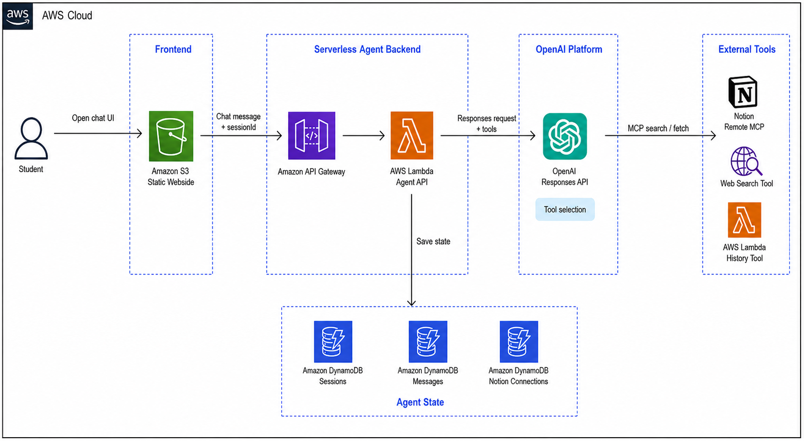
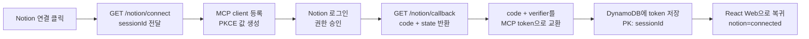

## Assignment: OpenAI Remote MCP와 Lambda로 Serverless Agent 만들기

OpenAI Responses API, Lambda, DynamoDB, Notion Remote MCP를 연결해 개인 노션과 자신의 대화 기록을 함께 조회하는 Serverless Agent 웹을 직접 만든다.

참고 자료:
- Agent 설계: https://www.anthropic.com/engineering/building-effective-agents
- OpenAI Responses API Web Search Tool 예시: https://developers.openai.com/cookbook/examples/responses_api/responses_example
- Model Context Protocol 소개: https://modelcontextprotocol.io/docs/getting-started/intro
- Hugging Face MCP Course: https://huggingface.co/learn/mcp-course/unit0/introduction (Unit 1의 MCP SDK까지 참고)
- OpenAI Remote MCP tools: https://platform.openai.com/docs/guides/tools-connectors-mcp
- Notion MCP client 구현: https://developers.notion.com/guides/mcp/build-mcp-client

> [!IMPORTANT]
> `OPENAI_API_KEY`는 브라우저 코드에 절대 넣지 않는다. API key는 Lambda 환경 변수에만 저장하고, React 웹은 API Gateway를 통해 Agent Lambda만 호출한다.

## 0. 전체 흐름 이해하기

### 0-1. 사용자 흐름

사용자는 웹에서 session을 만든 뒤 Notion을 연결하고 Agent에게 질문한다. `sessionId`는 브라우저 `localStorage`에도 저장되고, 같은 값이 DynamoDB sessions table의 partition key로도 저장된다.

Notion 연결:

```text
1. 웹에 접속하면 브라우저가 sessionId를 만들고 localStorage에 저장
2. 사용자가 첫 메시지를 보내거나 Notion 연결 버튼을 누르면 Agent Lambda가 DynamoDB sessions table에 session item 생성
3. 사용자가 Notion 연결 버튼 클릭
4. GET /notion/connect?sessionId={sessionId} 호출
5. Agent Lambda가 Notion MCP OAuth client를 동적으로 등록하고 PKCE 값을 생성
6. Agent Lambda가 Notion 로그인 및 권한 승인 화면으로 redirect
7. 사용자가 승인하면 Notion MCP OAuth callback이 GET /notion/callback으로 돌아옴
8. Agent Lambda가 sessionId 기준으로 Notion MCP access token을 DynamoDB에 저장
```

Agent 실행:

```text
1. 사용자가 채팅 메시지 입력
2. POST /agent/chat 호출
3. Agent Lambda가 사용자 메시지를 DynamoDB messages table에 저장
4. Agent Lambda가 전체 대화 history와 tool 목록을 OpenAI Responses API에 전달
5. OpenAI model이 필요한 tool을 선택
6. Notion MCP, DynamoDB history tool, web_search 결과를 바탕으로 최종 답변 생성
7. Agent Lambda가 assistant 답변을 DynamoDB messages table에 저장
8. 웹이 최종 답변과 사용된 tool 목록을 화면에 표시
```

전체 서버리스 아키텍처:



Notion MCP OAuth 인증 흐름:



### 0-2. Tool 흐름

Agent가 사용하는 tool은 역할과 사용 상황이 다르다.

| Tool | OpenAI tool type | 사용 상황 |
| --- | --- | --- |
| Notion Remote MCP | `mcp` | 개인 Notion 문서, 과제 메모, 운영 기준을 검색할 때 |
| DynamoDB history 검색 | `function` | 현재 session의 이전 대화 내용을 검색할 때 |
| Web Search | `web_search` | 최신 공개 문서나 웹 정보가 필요할 때 |

### 0-3. API 설명

| API | 역할 |
| --- | --- |
| `GET /notion/connect?sessionId={sessionId}` | Notion MCP OAuth client를 등록하고 Notion 로그인 및 권한 승인 화면으로 redirect한다. |
| `GET /notion/callback` | Notion MCP OAuth callback을 처리하고 MCP access token을 저장한다. |
| `GET /notion/status?sessionId={sessionId}` | 현재 session이 Notion에 연결되어 있는지 확인한다. |
| `POST /agent/chat` | 사용자 메시지를 받아 OpenAI Agent 답변을 생성한다. |
| `GET /agent/sessions` | 저장된 채팅 session 목록을 조회한다. |
| `GET /agent/sessions/{sessionId}/messages` | 특정 session의 메시지 history를 시간순으로 조회한다. |

### 0-4. DynamoDB Table 설명

| Table | Key | 역할 |
| --- | --- | --- |
| `keulkeul-agent-sessions` | `sessionId` | 채팅 session 목록과 마지막 메시지 요약을 저장한다. |
| `keulkeul-agent-messages` | `sessionId`, `createdAtMessageId` | user, assistant, tool 메시지를 시간순으로 저장한다. |
| `keulkeul-agent-notion-connections` | `sessionId` | Notion MCP access token과 연결 상태를 저장한다. |

### 0-5. Lambda 설명

HTTP 요청을 처리하는 Agent Lambda와 history 검색만 담당하는 Tool Lambda를 분리한다.

| Lambda | 역할 |
| --- | --- |
| `keulkeul-agent-api` | Notion MCP OAuth, chat 요청, session 조회, message 저장, OpenAI Responses API 호출을 처리한다. |
| `keulkeul-history-tool` | `search_agent_history` function tool 요청을 받아 DynamoDB messages table을 조회한다. |

> [!NOTE]
> Agent loop는 `POST /agent/chat` 요청 한 번 안에서만 실행한다. 모델이 tool call을 요청하면 Agent Lambda가 History Tool Lambda를 동기 호출하고, tool 결과를 다시 OpenAI Responses API에 전달해 다음 추론 턴을 이어간다.

## 1. 사전 준비

필요한 것:
- OpenAI API key
- Notion 계정과 Notion workspace
- 제공된 Lambda 코드: `lambda/agent_api.py`, `lambda/history_tool.py`, `lambda/requirements-agent.txt`
- 제공된 웹 코드: `web/app`

> [!IMPORTANT]
> Notion MCP는 사용자의 Notion 권한으로 workspace에 접근한다. 실습에서는 OpenAI에 노출하는 Notion MCP tool을 `notion-search`, `notion-fetch`로 제한한다.

## 2. DynamoDB Table 만들기

Agent session, message history, Notion MCP OAuth 연결 정보를 저장할 DynamoDB table 세 개를 만든다.

### 2-1. Sessions table 생성

1. AWS 콘솔 → **DynamoDB**로 이동
2. **Create table** 클릭
3. 설정값 입력
    - Table name: `keulkeul-agent-sessions`
    - Partition key: `sessionId`
    - Partition key type: `String`
    - Table settings: `Default settings`
    - Capacity mode: `On-demand`
4. **Create table** 클릭
5. 생성된 table 선택
6. **Additional settings** → **Time to Live (TTL)** 편집
    - TTL attribute name: `expiresAt`
7. 저장

### 2-2. Messages table 생성

1. DynamoDB → **Create table** 클릭
2. 설정값 입력
    - Table name: `keulkeul-agent-messages`
    - Partition key: `sessionId`
    - Partition key type: `String`
    - Sort key: `createdAtMessageId`
    - Sort key type: `String`
    - Table settings: `Default settings`
    - Capacity mode: `On-demand`
3. **Create table** 클릭
4. 생성된 table 선택
5. **Additional settings** → **Time to Live (TTL)** 편집
    - TTL attribute name: `expiresAt`
6. 저장

### 2-3. Notion connections table 생성

1. DynamoDB → **Create table** 클릭
2. 설정값 입력
    - Table name: `keulkeul-agent-notion-connections`
    - Partition key: `sessionId`
    - Partition key type: `String`
    - Table settings: `Default settings`
    - Capacity mode: `On-demand`
3. **Create table** 클릭
4. 생성된 table 선택
5. **Additional settings** → **Time to Live (TTL)** 편집
    - TTL attribute name: `expiresAt`
6. 저장

### 2-4. 저장되는 주요 필드

| Table | 주요 필드 |
| --- | --- |
| `keulkeul-agent-sessions` | `sessionId`, `title`, `lastMessage`, `messageCount`, `createdAt`, `updatedAt`, `expiresAt` |
| `keulkeul-agent-messages` | `sessionId`, `createdAtMessageId`, `messageId`, `role`, `content`, `toolCalls`, `createdAt`, `expiresAt` |
| `keulkeul-agent-notion-connections` | `sessionId`, `connected`, `accessToken`, `refreshToken`, `tokenType`, `workspaceName`, `userId`, `createdAt`, `updatedAt`, `expiresAt` |

> [!IMPORTANT]
> Notion MCP access token과 OAuth 진행 중 임시로 필요한 `oauthState`, `codeVerifier`, `mcpClientId`를 같은 table에 저장한다.

## 3. Lambda 실행 Role 만들기

Agent Lambda와 History Tool Lambda가 서로 다른 권한을 갖도록 실행 role을 두 개 만든다. Agent Lambda는 HTTP 요청, OpenAI 호출, session 저장, tool Lambda 호출을 담당하고, History Tool Lambda는 messages table 조회만 담당한다.

### 3-1. Agent Lambda Role 생성

1. AWS 콘솔 → **IAM** → **Roles**로 이동
2. **Create role** 클릭
3. Trusted entity type: `AWS service`
4. Use case: `Lambda`
5. Permission policies에서 `AWSLambdaBasicExecutionRole` 선택
6. Role name: `keulkeul-agent-lambda-role`
7. **Create role** 클릭

### 3-2. Agent Lambda inline policy 추가

1. `keulkeul-agent-lambda-role` 선택
2. **Add permissions** → **Create inline policy** 클릭
3. **JSON** 탭 선택
4. 아래 JSON에서 `{REGION}`, `{ACCOUNT_ID}`를 본인 값으로 바꿔 입력

```json
{
  "Version": "2012-10-17",
  "Statement": [
    {
      "Sid": "SessionsTableAccess",
      "Effect": "Allow",
      "Action": [
        "dynamodb:PutItem",
        "dynamodb:GetItem",
        "dynamodb:Query",
        "dynamodb:Scan",
        "dynamodb:UpdateItem"
      ],
      "Resource": "arn:aws:dynamodb:{REGION}:{ACCOUNT_ID}:table/keulkeul-agent-sessions"
    },
    {
      "Sid": "MessagesTableAccess",
      "Effect": "Allow",
      "Action": [
        "dynamodb:PutItem",
        "dynamodb:GetItem",
        "dynamodb:Query",
        "dynamodb:UpdateItem"
      ],
      "Resource": "arn:aws:dynamodb:{REGION}:{ACCOUNT_ID}:table/keulkeul-agent-messages"
    },
    {
      "Sid": "NotionConnectionsTableAccess",
      "Effect": "Allow",
      "Action": [
        "dynamodb:PutItem",
        "dynamodb:GetItem",
        "dynamodb:UpdateItem"
      ],
      "Resource": "arn:aws:dynamodb:{REGION}:{ACCOUNT_ID}:table/keulkeul-agent-notion-connections"
    },
    {
      "Sid": "InvokeHistoryTool",
      "Effect": "Allow",
      "Action": [
        "lambda:InvokeFunction"
      ],
      "Resource": "arn:aws:lambda:{REGION}:{ACCOUNT_ID}:function:keulkeul-history-tool"
    }
  ]
}
```

5. Policy name: `keulkeul-agent-inline`
6. **Create policy** 클릭

### 3-3. History Tool Lambda Role 생성

1. IAM → **Roles** → **Create role** 클릭
2. Trusted entity type: `AWS service`
3. Use case: `Lambda`
4. Permission policies에서 `AWSLambdaBasicExecutionRole` 선택
5. Role name: `keulkeul-history-tool-role`
6. **Create role** 클릭

### 3-4. History Tool inline policy 추가

1. `keulkeul-history-tool-role` 선택
2. **Add permissions** → **Create inline policy** 클릭
3. **JSON** 탭 선택
4. 아래 JSON에서 `{REGION}`, `{ACCOUNT_ID}`를 본인 값으로 바꿔 입력

```json
{
  "Version": "2012-10-17",
  "Statement": [
    {
      "Effect": "Allow",
      "Action": [
        "dynamodb:GetItem",
        "dynamodb:Query"
      ],
      "Resource": "arn:aws:dynamodb:{REGION}:{ACCOUNT_ID}:table/keulkeul-agent-messages"
    }
  ]
}
```

5. Policy name: `keulkeul-history-tool-inline`
6. **Create policy** 클릭

## 4. Agent Lambda와 History Tool Lambda 만들기

OpenAI Responses API 호출, Notion MCP OAuth 처리, 대화 history 저장을 담당하는 Agent Lambda와 history 검색을 담당하는 Tool Lambda를 만든다.

### 4-1. Agent Lambda 함수 생성

1. AWS 콘솔 → **Lambda**로 이동
2. **Create function** 클릭
3. 설정값 입력
    - Function name: `keulkeul-agent-api`
    - Runtime: `Python 3.12`
    - Architecture: `x86_64`
    - Execution role: `Use an existing role`
    - Existing role: `keulkeul-agent-lambda-role`
4. **Create function** 클릭
5. **Configuration** → **General configuration** → **Edit** 클릭
6. 설정값 변경
    - Memory: `1024 MB`
    - Timeout: `90 seconds`
7. 저장

### 4-2. 환경 변수 추가

| Key | Value |
| --- | --- |
| `OPENAI_API_KEY` | 본인의 OpenAI API key |
| `HISTORY_TOOL_FUNCTION` | `keulkeul-history-tool` |
| `API_BASE_URL` | API Gateway 생성 후 입력할 Invoke URL |
| `WEB_BASE_URL` | S3 정적 웹 배포 후 입력할 website endpoint |

> [!NOTE]
> `API_BASE_URL`은 Notion MCP OAuth callback을 받을 API Gateway 주소이고, `WEB_BASE_URL`은 OAuth 완료 후 사용자를 돌려보낼 React 웹 주소다. 두 값은 각각 6장과 8장에서 다시 입력한다.

### 4-3. 코드 배포

Agent Lambda는 OpenAI Python SDK가 필요하므로 배포 zip에 `openai` 패키지를 함께 넣는다.

```bash
# 이전에 만든 package 폴더와 zip이 있으면 지운다.
rm -rf package agent-api.zip
mkdir package

# --platform: Lambda Python 3.12 런타임이 사용하는 Linux 패키지 형식을 지정한다.
# --implementation: CPython용 패키지를 사용한다.
# --python-version: Lambda runtime과 같은 Python 3.12용 패키지를 사용한다.
# --only-binary: 소스 빌드 없이 이미 빌드된 패키지만 사용한다.
python -m pip install \
  -r lambda/requirements-agent.txt \
  --platform manylinux2014_x86_64 \
  --implementation cp \
  --python-version 3.12 \
  --only-binary=:all: \
  -t package/

cp lambda/agent_api.py package/agent_api.py
cd package
zip -r ../agent-api.zip .
```

Lambda 콘솔에서 **Code** 탭 → **Upload from** → `.zip file`을 선택하고 `agent-api.zip`을 업로드한다.

업로드 후 **Runtime settings** → **Edit**에서 Handler를 `agent_api.lambda_handler`로 바꾼다.

### 4-4. History Tool Lambda 함수 생성

1. Lambda → **Create function** 클릭
2. 설정값 입력
    - Function name: `keulkeul-history-tool`
    - Runtime: `Python 3.12`
    - Architecture: `x86_64`
    - Execution role: `Use an existing role`
    - Existing role: `keulkeul-history-tool-role`
3. **Create function** 클릭
4. **Configuration** → **General configuration** → **Edit** 클릭
5. 설정값 변경
    - Memory: `256 MB`
    - Timeout: `10 seconds`
6. 저장

### 4-5. History Tool 코드 배포

History Tool은 외부 패키지가 필요 없으므로 코드 파일만 zip으로 묶는다.

```bash
rm -rf history-tool.zip
cd lambda
zip ../history-tool.zip history_tool.py
```

Lambda 콘솔에서 **Code** 탭 → **Upload from** → `.zip file`을 선택하고 `history-tool.zip`을 업로드한다.

업로드 후 **Runtime settings** → **Edit**에서 Handler를 `history_tool.lambda_handler`로 바꾼다.

## 5. OpenAI Tool 구성 이해하기

Agent Lambda는 OpenAI Responses API를 호출할 때 세 종류의 tool을 함께 전달한다.

### 5-1. Notion Remote MCP tool

Notion MCP tool은 사용자의 Notion workspace를 검색하고 문서를 읽을 때 사용한다.

```jsonc
{
  "type": "mcp",
  "server_label": "notion",
  "server_url": "https://mcp.notion.com/mcp",
  "authorization": "{NOTION_MCP_ACCESS_TOKEN}",
  "allowed_tools": ["notion-search", "notion-fetch"],
  "require_approval": "never"
}
```

Agent는 아래처럼 개인 문서가 필요한 질문에서 Notion MCP를 사용한다.

```text
내 Notion에 적어둔 serverless agent 실습 기준을 찾아줘.
```

### 5-2. DynamoDB history function tool

`search_agent_history`는 현재 session의 이전 대화 내용을 DynamoDB에서 검색하는 function tool이다. OpenAI에는 function tool schema만 전달하고, 실제 DynamoDB 조회는 Agent Lambda가 동기 호출하는 `keulkeul-history-tool` Lambda가 처리한다.

```jsonc
{
  "type": "function",
  "name": "search_agent_history",
  "description": "현재 session의 이전 대화 history에서 keyword와 관련된 메시지를 검색한다.",
  "parameters": {
    "type": "object",
    "properties": {
      "sessionId": {
        "type": "string",
        "description": "검색할 대화 session ID"
      },
      "keyword": {
        "type": "string",
        "description": "찾고 싶은 대화 내용 keyword"
      }
    },
    "required": ["sessionId", "keyword"]
  }
}
```

Agent는 아래처럼 이전 대화 맥락이 필요한 질문에서 history tool을 사용한다.

```text
방금 내가 Notion 실습 기준에 대해 뭐라고 물어봤지?
```

> [!NOTE]
> DynamoDB Query는 같은 `sessionId`를 가진 message item을 sort key 순서로 빠르게 가져올 수 있다. keyword 검색은 가져온 최근 message 안에서 History Tool Lambda가 필터링한다.

### 5-3. Web Search tool

Web Search tool은 최신 공개 정보가 필요한 질문에서 사용한다.

```jsonc
{
  "type": "web_search"
}
```

Agent는 아래처럼 최신 문서 확인이 필요한 질문에서 web search를 사용한다.

```text
최신 Lambda 환경 변수 보안 권장사항을 찾아서 내 Notion 기준과 비교해줘.
```

### 5-4. Tool 사용 정책

| 상황 | 우선 사용할 tool |
| --- | --- |
| 사용자의 개인 기준, 회의록, 과제 메모가 필요함 | Notion Remote MCP |
| 이전 대화에서 말한 내용을 다시 확인해야 함 | `search_agent_history` |
| 최신 공개 문서나 현재 정보를 확인해야 함 | Web Search |
| Notion과 Web Search 내용이 충돌함 | 출처를 구분해서 답하고, 최신 공식 문서를 우선 표시 |

## 6. API Gateway 만들기

웹 앱이 Agent Lambda를 HTTP로 호출할 수 있도록 HTTP API를 만든다.

### 6-1. HTTP API 생성

1. AWS 콘솔 → **API Gateway**로 이동
2. **Create API** 클릭
3. **HTTP API** 선택
4. Integrations에서 **Lambda** 선택
5. Lambda function: `keulkeul-agent-api`
6. API name: `keulkeul-agent-api`
7. Configure routes에서 아래 route 추가

### 6-2. Route 추가

| Method | Path |
| --- | --- |
| `GET` | `/notion/connect` |
| `GET` | `/notion/callback` |
| `GET` | `/notion/status` |
| `POST` | `/agent/chat` |
| `GET` | `/agent/sessions` |
| `GET` | `/agent/sessions/{sessionId}/messages` |

8. 각 route의 integration을 `keulkeul-agent-api`로 설정
9. Stage는 `$default`, Auto-deploy는 enabled 유지
10. **Create** 클릭

### 6-3. CORS 설정

1. 생성한 API 선택
2. **CORS** 메뉴 선택
3. 실습 초반에는 설정값 입력
    - Access-Control-Allow-Origin: `*`
    - Access-Control-Allow-Headers: `content-type`
    - Access-Control-Allow-Methods: `GET`, `POST`, `OPTIONS`
4. 저장

> [!NOTE]
> S3 website endpoint를 확인한 뒤에는 `Access-Control-Allow-Origin`을 최종 웹 endpoint로 제한한다.

### 6-4. Invoke URL 메모

API invoke URL을 메모한다.

```text
예: https://abc123xyz.execute-api.ap-northeast-2.amazonaws.com
```

메모한 Invoke URL을 Lambda 환경 변수 `API_BASE_URL`에 입력하고 저장한다.

## 7. 정적 웹 만들기

브라우저에서 Notion 연결, 채팅 입력, history 조회를 처리할 React + Vite 앱을 준비한다.

### 7-1. 웹 앱 폴더로 이동

앱 폴더로 이동한다.

```bash
cd web/app
```

### 7-2. API URL 연결

`src/main.jsx` 파일에서 API Gateway Invoke URL로 교체한다.

```text
const API_BASE = "https://{본인_API_ID}.execute-api.{REGION}.amazonaws.com";
```

### 7-3. 로컬에서 화면 확인

로컬에서 실행해 화면을 확인한다.

```bash
npm install
npm run dev
```

브라우저에서 Vite가 출력한 local URL을 연다.

### 7-4. 정적 파일 빌드

S3에 업로드할 정적 파일을 빌드한다.

```bash
npm run build
```

생성되는 폴더: `web/app/dist`

## 8. S3 정적 웹으로 배포하기

React 앱을 S3에 올리고 S3 website endpoint로 접속한다.

### 8-1. Static Web Bucket 만들기

1. AWS 콘솔 → **S3**로 이동
2. **Create bucket** 클릭
3. 설정값 입력
    - Bucket name: `keulkeul-agent-web-{본인이름}`
    - Region: 실습 리전
    - **Block all public access** 체크 해제
4. 경고 확인 체크
5. **Create bucket** 클릭

### 8-2. Static website hosting 켜기

1. Static web bucket 선택
2. **Properties** 탭
3. **Static website hosting** 편집
4. Enable 선택
5. Index document: `index.html`
6. Error document: `index.html`
7. 저장

### 8-3. Bucket policy 추가

1. **Permissions** 탭
2. **Bucket policy** 편집
3. `{WEB_BUCKET}`을 본인 static web bucket 이름으로 바꿔 입력
4. `{MY_IP_CIDR}`를 본인 pubiic IP의 CIDR로 바꿔 입력
    - 예: 공인 IP가 `203.0.113.10`이면 `203.0.113.10/32`

```json
{
  "Version": "2012-10-17",
  "Statement": [
    {
      "Sid": "ReadFromMyIpOnlyForLabWebsite",
      "Effect": "Allow",
      "Principal": "*",
      "Action": "s3:GetObject",
      "Resource": "arn:aws:s3:::{WEB_BUCKET}/*",
      "Condition": {
        "IpAddress": {
          "aws:SourceIp": "{MY_IP_CIDR}"
        }
      }
    }
  ]
}
```

> [!IMPORTANT]
> 집, 학교, 카페처럼 네트워크가 바뀌면 공인 IP도 바뀔 수 있다. 웹사이트 접속이 갑자기 안 되면 bucket policy의 `{MY_IP_CIDR}` 값을 현재 public IP로 다시 수정한다.

### 8-4. Build 결과물 업로드

1. Static web bucket → **Objects** 탭
2. **Upload** 클릭
3. `web/app/dist/` 폴더 안의 `index.html`과 `assets/` 폴더 업로드
4. Properties 탭의 **Bucket website endpoint**를 메모
5. 메모한 S3 website endpoint를 Agent Lambda 환경 변수 `WEB_BASE_URL`에 입력하고 저장

```text
예: http://keulkeul-agent-web-{본인이름}.s3-website.ap-northeast-2.amazonaws.com
```

### 8-5. CORS Origin 제한

API Gateway CORS 설정에서 `Access-Control-Allow-Origin`을 S3 website endpoint로 제한한다.

```text
http://{WEB_BUCKET}.s3-website.{REGION}.amazonaws.com
```

## 9. Agent 테스트하기

S3 website endpoint로 접속해 Notion MCP, DynamoDB history tool, web_search가 각각 동작하는지 확인한다.

### 9-1. Notion 테스트 문서 만들기

Notion에 테스트용 문서를 만든다.

문서 제목 예시:

```text
내 agent 실습 기준
```

문서 내용 예시:

```text
Week 5 Level 2 Agent는 Notion MCP, DynamoDB history 검색, web_search 세 tool을 사용한다.
Notion은 개인 기준을 찾을 때 사용하고, DynamoDB는 이전 대화를 찾을 때 사용한다.
최신 공개 문서가 필요한 경우 web_search를 사용한다.
```

### 9-2. Notion 연결 확인

1. S3 website endpoint로 접속
2. **Notion 연결** 클릭
3. Notion 로그인 및 권한 승인
4. 웹으로 돌아온 뒤 Notion 연결 상태가 `connected`인지 확인

### 9-3. Notion MCP 동작 확인

채팅창에 입력한다.

```text
내 Notion에서 agent 실습 기준을 찾아줘.
```

확인할 것:

- 답변이 Notion 문서 내용을 근거로 하는지 확인
- Notion에만 적어둔 문구나 기준을 답변에 반영하는지 확인
- Used tools에 `mcp`가 표시되는지 확인

### 9-4. DynamoDB history tool 동작 확인

이전 질문이 저장된 뒤 채팅창에 입력한다.

```text
방금 내가 agent 실습 기준에 대해 뭐라고 물어봤지?
```

확인할 것:

- 답변이 이전 user message를 언급하는지 확인
- Used tools에 `search_agent_history`가 표시되는지 확인
- DynamoDB `keulkeul-agent-messages` table에 user/assistant message가 저장됐는지 확인

### 9-5. Web Search 동작 확인

채팅창에 입력한다.

```text
최신 Lambda 환경 변수 보안 권장사항도 찾아서 같이 정리해줘.
```

확인할 것:

- 답변이 최신 공개 웹 정보와 내부 Notion 기준을 구분해서 설명하는지 확인
- 최신 공개 웹 문서 기준으로 답변을 갱신하는지 확인
- Used tools에 `web_search`가 표시되는지 확인

### 9-6. 세 tool 종합 테스트

채팅창에 입력한다.

```text
내 Notion에 적어둔 agent 실습 기준, 방금 나눈 대화, 최신 Lambda 보안 권장사항을 합쳐서 최종 체크리스트를 만들어줘.
```

확인할 것:

- Notion 문서 내용이 반영되는지 확인
- 이전 대화 history가 반영되는지 확인
- 최신 웹 검색 결과가 필요한 경우 함께 반영되는지 확인
- Used tools에 `mcp`, `search_agent_history`, `web_search`가 표시되는지 확인
- Agent가 출처가 다른 정보를 섞지 않고 구분해서 답하는지 확인

## 10. 실습 질문

아래 질문에 짧게 답한다.

1. MCP tool과 function tool의 차이는 무엇인가?
2. Notion MCP access token을 브라우저가 아니라 Lambda와 DynamoDB 쪽에 저장하는 이유는 무엇인가?
3. DynamoDB Query가 session별 history 검색에 적합한 이유는 무엇인가?
4. DynamoDB Query만으로 자연어 의미 검색을 하기 어려운 이유는 무엇인가?
5. Web Search와 Notion 검색 결과가 서로 다르면 어떤 기준으로 답변해야 하는가?
6. `OPENAI_API_KEY`를 프론트엔드에 넣으면 안 되는 이유는 무엇인가?
7. Lambda가 stateless인데 대화 history를 유지할 수 있는 이유는 무엇인가?
8. Notion MCP에 쓰기 tool을 바로 허용하면 어떤 위험이 있는가?

## 11. 리소스 정리

실습 완료 후 아래 순서로 리소스를 삭제한다.

1. **정적 웹 S3 bucket 삭제**
    - `index.html` 객체와 `assets/` 객체를 삭제한다.
    - bucket을 비운 뒤 삭제한다.

2. **API Gateway 삭제**
    - API Gateway 콘솔에서 `keulkeul-agent-api` 삭제

3. **Lambda 함수 삭제**
    - Lambda 콘솔에서 `keulkeul-agent-api` 삭제
    - Lambda 콘솔에서 `keulkeul-history-tool` 삭제

4. **DynamoDB Table 삭제**
    - `keulkeul-agent-sessions` 삭제
    - `keulkeul-agent-messages` 삭제
    - `keulkeul-agent-notion-connections` 삭제

5. **CloudWatch Log Group 확인**
    - `/aws/lambda/keulkeul-agent-api`
    - `/aws/lambda/keulkeul-history-tool`
    - 로그 그룹이 남아 있으면 삭제

6. **Notion 연결 해제**
    - Notion 설정에서 실습용 MCP 연결 권한을 해제한다.
