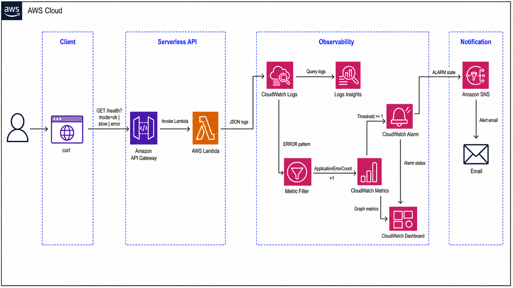

## Assignment: CloudWatch로 Lambda API 장애 감지와 알림 만들기

일부러 정상 응답, 느린 응답, 실패 응답을 만드는 Lambda API를 배포하고, CloudWatch Logs Insights, Metric Filter, Alarm, SNS, Dashboard를 연결해 작은 운영 관측 시스템을 만든다.

참고 자료:
- CloudWatch Logs Insights: https://docs.aws.amazon.com/AmazonCloudWatch/latest/logs/AnalyzingLogData.html
- CloudWatch metric filter: https://docs.aws.amazon.com/AmazonCloudWatch/latest/logs/MonitoringLogData.html
- CloudWatch alarm: https://docs.aws.amazon.com/AmazonCloudWatch/latest/monitoring/CloudWatch_Alarms.html
- CloudWatch dashboard: https://docs.aws.amazon.com/AmazonCloudWatch/latest/monitoring/CloudWatch_Dashboards.html

> [!NOTE]
> CloudWatch는 로그를 저장하는 곳이면서 동시에 metric, alarm, dashboard를 통해 운영 상태를 판단하는 관측 도구다. 이번 실습에서는 로그를 먼저 남기고, 로그를 분석한 뒤, 중요한 로그 패턴을 metric으로 바꿔 alarm을 만든다.

## 0. 전체 흐름 이해하기

### 0-1. 사용자 흐름
```text
1. 사용자가 /health?mode=ok 호출
2. Lambda가 정상 응답을 반환하고 INFO 로그를 남김
3. 사용자가 /health?mode=slow 호출
4. Lambda가 일부러 지연된 응답을 반환하고 latencyMs 로그를 남김
5. 사용자가 /health?mode=error 호출
6. Lambda가 500 응답을 반환하고 ERROR 로그를 남김
7. CloudWatch Logs Insights로 요청 수, 에러 수, 평균 latency를 분석
8. Metric Filter가 ERROR 로그를 ApplicationErrorCount metric으로 변환
9. CloudWatch Alarm이 ApplicationErrorCount를 감시
10. Alarm 상태가 ALARM으로 바뀌면 SNS가 이메일 알림 발송
```

전체 CloudWatch 리소스 흐름:



### 0-2. CloudWatch 구성 요소

| 구성 요소 | 역할 |
| --- | --- |
| CloudWatch Logs | Lambda가 출력한 로그를 저장한다. |
| Logs Insights | 저장된 로그를 query로 검색하고 시간대별로 집계한다. |
| Metric Filter | 로그 패턴을 숫자 metric으로 변환한다. |
| CloudWatch Metrics | Lambda 호출 수, 실행 시간, custom error count 같은 시계열 값을 저장한다. |
| CloudWatch Alarm | metric이 정해진 기준을 넘었는지 판단한다. |
| SNS | alarm 상태 변화 알림을 이메일로 보낸다. |
| Dashboard | 운영자가 주요 metric과 alarm 상태를 한 화면에서 본다. |

### 0-3. 로그와 metric의 차이

| 구분 | 예시 | 사용 목적 |
| --- | --- | --- |
| 로그 | `{"level": "ERROR", "statusCode": 500}` | 요청 하나에서 무슨 일이 있었는지 확인 |
| Metric | `ApplicationErrorCount = 3` | 일정 시간 동안 몇 번 발생했는지 시계열로 집계 |
| Alarm | `ApplicationErrorCount >= 1` | 위험 상태를 자동으로 판단하고 알림 발송 |

## 1. 사전 준비

필요한 것:

- AWS 계정 및 IAM 권한
    - Lambda
    - API Gateway
    - CloudWatch
    - SNS
    - IAM Role
- 알림을 받을 이메일 주소
- 브라우저 또는 `curl`을 실행할 수 있는 터미널 **(우분투 권장)**

## 2. Lambda 실행 Role 만들기

Lambda가 CloudWatch Logs에 로그를 쓸 수 있도록 실행 role을 만든다.

1. AWS 콘솔 → **IAM** → **Roles**로 이동
2. **Create role** 클릭
3. Trusted entity type: `AWS service`
4. Use case: `Lambda`
5. Permission policies에서 `AWSLambdaBasicExecutionRole` 선택
6. Role name: `keulkeul-cloudwatch-lambda-role`
7. **Create role** 클릭

> [!NOTE]
> `AWSLambdaBasicExecutionRole`에는 Lambda가 CloudWatch Logs에 log group과 log stream을 만들고 로그 이벤트를 기록하는 권한이 포함되어 있다.

## 3. 테스트 Lambda 만들기

정상, 지연, 실패 응답을 만들 Lambda 함수를 생성한다.

### 3-1. Lambda 함수 생성

1. AWS 콘솔 → **Lambda**로 이동
2. **Create function** 클릭
3. 설정값 입력
    - Function name: `keulkeul-cloudwatch-api`
    - Runtime: `Python 3.12`
    - Architecture: `x86_64`
    - Execution role: `Use an existing role`
    - Existing role: `keulkeul-cloudwatch-lambda-role`
4. **Create function** 클릭
5. **Configuration** → **General configuration** → **Edit** 클릭
6. 설정값 변경
    - Memory: `128 MB`
    - Timeout: `10 seconds`
7. 저장

### 3-2. Lambda 코드 작성

제공된 Lambda 코드 [`lambda_function.py`](./lambda_function.py)를 Lambda 콘솔의 `lambda_function.py`에 붙여넣은 뒤 **Deploy**를 클릭한다.

확인할 것:

- Handler가 기본값인 `lambda_function.lambda_handler`로 되어 있는가?
- 코드가 `mode=ok`, `mode=slow`, `mode=error`를 구분해 응답하도록 작성되어 있는가?
- `print()`로 JSON 한 줄 로그를 남기도록 작성되어 있는가?

## 4. API Gateway 만들기

브라우저나 `curl`에서 Lambda를 호출할 수 있도록 HTTP API를 만든다.

### 4-1. HTTP API 생성

1. AWS 콘솔 → **API Gateway**로 이동
2. **Create API** 클릭
3. **HTTP API** 선택
4. Integrations에서 **Lambda** 선택
5. Lambda function: `keulkeul-cloudwatch-api`
6. API name: `keulkeul-cloudwatch-api`
7. Configure routes에서 route 추가
    - Method: `GET`
    - Path: `/health`
8. Stage는 `$default`, Auto-deploy는 enabled 유지
9. **Create** 클릭

### 4-2. Invoke URL 메모

API 생성 후 표시되는 Invoke URL을 메모한다.

```text
예: https://abc123xyz.execute-api.ap-northeast-2.amazonaws.com
```

이후 실습에서는 아래처럼 호출한다.

```text
https://{API_INVOKE_URL}/health?mode=ok
https://{API_INVOKE_URL}/health?mode=slow
https://{API_INVOKE_URL}/health?mode=error
```

## 5. API 호출해서 로그 만들기

CloudWatch에서 분석할 로그가 쌓이도록 API를 여러 번 호출한다.

터미널에서 아래 명령을 실행한다.

```bash
API_URL="https://{본인_API_ID}.execute-api.{REGION}.amazonaws.com"

curl "$API_URL/health?mode=ok"
curl "$API_URL/health?mode=ok"
curl "$API_URL/health?mode=slow"
curl "$API_URL/health?mode=error"
curl "$API_URL/health?mode=error"
```

확인할 것:

- `mode=ok`는 HTTP 200 응답을 반환하는가?
- `mode=slow`는 응답이 약 2초 늦게 오는가?
- `mode=error`는 HTTP 500 응답을 반환하는가?
- 응답 body에 `statusCode`, `latencyMs`가 포함되는가?

## 6. CloudWatch Logs 확인하기

Lambda가 출력한 로그가 CloudWatch Logs에 저장됐는지 확인한다.

1. AWS 콘솔 → **CloudWatch**로 이동
2. **Logs** → **Log groups** 선택
3. `/aws/lambda/keulkeul-cloudwatch-api` log group 선택
4. 최신 log stream 선택
5. `START`, `END`, `REPORT` 로그와 직접 출력한 JSON 로그를 확인

확인할 것:

- Lambda 호출마다 log stream에 로그가 쌓이는가?
- `mode=error` 요청에서 `level`이 `ERROR`로 기록되는가?
- `mode=slow` 요청에서 `latencyMs` 값이 크게 기록되는가?

### 6-1. Log retention 설정

실습 로그가 오래 남지 않도록 log group의 보존 기간을 설정한다.

1. `/aws/lambda/keulkeul-cloudwatch-api` log group 화면으로 이동
2. **Actions** → **Edit retention setting** 클릭
3. Retention setting: `1 day` 선택
4. **Save** 클릭

> [!NOTE]
> 기본 설정인 `Never expire`는 로그를 계속 보관한다. 실습이나 개발 환경에서는 보존 기간을 짧게 두면 비용과 불필요한 로그 누적을 줄일 수 있다.

## 7. Logs Insights로 시계열 분석하기

Logs Insights query로 로그를 검색하고 시간대별로 집계한다.

### 7-1. 최근 요청 로그 보기

1. CloudWatch → **Logs Insights**로 이동
2. Log group에서 `/aws/lambda/keulkeul-cloudwatch-api` 선택
3. 시간 범위를 최근 30분으로 설정
4. 아래 query 실행

> [!NOTE]
> 쿼리에서 `fields`는 결과에 보여줄 필드를 선택한다.
> `filter`는 이번 실습 Lambda가 남긴 로그만 남긴다.
> `sort`는 최신 로그가 위에 오도록 정렬한다.
> `limit`는 결과를 최대 20개만 보여준다.

```sql
fields @timestamp, level, mode, statusCode, latencyMs
| filter service = "keulkeul-cloudwatch-api"
| sort @timestamp desc
| limit 20
```

확인할 것:

- 최근 요청 로그가 최신순으로 보이는가?
- `mode`, `statusCode`, `latencyMs` 필드가 분리되어 보이는가?

### 7-2. 1분 단위 요청 수와 latency 보기

아래 query를 실행한다.

> [!NOTE]
> 쿼리에서 `filter`는 이번 실습 Lambda가 남긴 로그만 남긴다.
> `stats`는 1분 단위로 요청 수, 평균 latency, p95 latency를 계산한다.
> `bin(1m)`은 로그 timestamp를 1분 간격으로 묶는다.
> `sort`는 최근 1분 구간이 위에 오도록 정렬한다.

```sql
filter service = "keulkeul-cloudwatch-api"
| stats count(*) as requestCount,
    avg(latencyMs) as avgLatencyMs,
    pct(latencyMs, 95) as p95LatencyMs
  by bin(1m)
| sort @timestamp desc
```

확인할 것:

- 1분 단위 요청 수가 집계되는가?
- `mode=slow` 요청을 보낸 시간대의 평균 latency가 올라가는가?

### 7-3. 1분 단위 에러 수 보기

아래 query를 실행한다.

> [!NOTE]
> 쿼리에서 `filter`는 이번 실습 Lambda 로그 중 `ERROR` 로그만 남긴다.
> `stats`는 1분 단위로 에러 로그 개수를 계산한다.
> `sort`는 최근 1분 구간이 위에 오도록 정렬한다.

```sql
filter service = "keulkeul-cloudwatch-api" and level = "ERROR"
| stats count(*) as errorCount by bin(1m)
| sort @timestamp desc
```

확인할 것:

- `mode=error` 요청을 보낸 시간대에 `errorCount`가 증가하는가?

## 8. Metric Filter 만들기

`ERROR` 로그를 CloudWatch custom metric으로 변환한다.

1. CloudWatch → **Logs** → **Log groups**로 이동
2. `/aws/lambda/keulkeul-cloudwatch-api` 선택
3. **Metric filters** 탭 선택
4. **Create metric filter** 클릭
5. Filter pattern 입력

```text
{ $.level = "ERROR" }
```

6. **Test pattern**에서 `ERROR` 로그가 매칭되는지 확인
7. **Next** 클릭
8. Metric 설정값 입력
    - Filter name: `keulkeul-application-error-filter`
    - Metric namespace: `KeulKeul/CloudWatch`
    - Metric name: `ApplicationErrorCount`
    - Metric value: `1`
    - Unit: `Count`
9. **Create metric filter** 클릭

> [!IMPORTANT]
> Metric Filter 생성 이후에 발생한 로그부터 metric으로 변환된다. 필터 생성 후 `mode=error` 요청을 다시 보내야 metric data point가 생긴다.

필터 생성 후 에러 요청을 다시 보낸다.

```bash
curl "$API_URL/health?mode=error"
curl "$API_URL/health?mode=error"
```

## 9. Custom Metric 확인하기

Metric Filter가 만든 custom metric을 확인한다.

1. CloudWatch → **Metrics** → **All metrics**로 이동
2. **Custom namespaces**에서 `KeulKeul/CloudWatch` 선택
3. `ApplicationErrorCount` metric 선택
4. Statistic을 `Sum`으로 설정
5. Period를 `1 minute`로 설정

## 10. SNS Topic 만들기

Alarm 알림을 받을 SNS topic과 email subscription을 만든다.

### 10-1. Topic 생성

1. AWS 콘솔 → **SNS**로 이동
2. **Topics** → **Create topic** 클릭
3. 설정값 입력
    - Type: `Standard`
    - Name: `keulkeul-cloudwatch-alarm-topic`
4. **Create topic** 클릭
5. 생성된 Topic ARN을 메모한다.

### 10-2. 이메일 구독

1. `keulkeul-cloudwatch-alarm-topic` 화면에서 **Create subscription** 클릭
2. 설정값 입력
    - Protocol: `Email`
    - Endpoint: 본인 이메일 주소
3. **Create subscription** 클릭
4. 이메일함에서 AWS 확인 메일을 연다.
5. **Confirm subscription** 클릭

> [!IMPORTANT]
> 이메일 구독을 확인하지 않으면 Alarm이 SNS에 메시지를 보내도 이메일이 도착하지 않는다.

## 11. CloudWatch Alarm 만들기

`ApplicationErrorCount`가 1분 동안 1 이상이면 ALARM 상태가 되도록 설정한다.

1. CloudWatch → **Alarms** → **All alarms**로 이동
2. **Create alarm** 클릭
3. **Select metric** 클릭
4. `KeulKeul/CloudWatch` → `ApplicationErrorCount` metric 선택
5. Metric 조건 설정
    - Statistic: `Sum`
    - Period: `1 minute`
6. Threshold 설정
    - Threshold type: `Static`
    - Whenever `ApplicationErrorCount` is: `Greater/Equal`
    - than: `1`
7. Additional configuration 설정
    - Datapoints to alarm: `1 out of 1`
    - Missing data treatment: `Treat missing data as not breaching`
8. Notification 설정
    - Alarm state trigger: `In alarm`
    - SNS topic: `keulkeul-cloudwatch-alarm-topic`
9. Alarm name: `keulkeul-application-error-alarm`
10. **Create alarm** 클릭

> [!NOTE]
> 실습에서는 알림을 빠르게 확인하기 위해 1분 동안 에러 1개만 발생해도 ALARM 상태가 되도록 설정한다. 실제 운영 환경에서는 서비스 특성과 알림 피로도를 고려해 threshold와 evaluation period를 조정한다.

## 12. Alarm 동작 테스트하기

Alarm이 실제로 ALARM 상태로 바뀌고 이메일이 오는지 확인한다.

1. 에러 요청을 여러 번 보낸다.

```bash
curl "$API_URL/health?mode=error"
curl "$API_URL/health?mode=error"
curl "$API_URL/health?mode=error"
```

2. CloudWatch → **Alarms** → **All alarms**에서 `keulkeul-application-error-alarm` 선택
3. 1~2분 정도 기다린 뒤 상태를 확인
4. 이메일함에서 SNS 알림이 도착했는지 확인

> [!NOTE]
> CloudWatch metric과 alarm 평가는 실시간처럼 보이지만 약간의 지연이 있을 수 있다. 요청 직후 바로 ALARM이 보이지 않으면 1~2분 정도 기다린다.

## 13. Dashboard 만들기

운영자가 한 화면에서 API 상태를 볼 수 있도록 CloudWatch Dashboard를 만든다.

1. CloudWatch → **Dashboards**로 이동
2. **Create dashboard** 클릭
3. Dashboard name: `keulkeul-cloudwatch-dashboard`
4. Widget type: `Line`
5. 아래 metric을 추가한다.
    - `AWS/Lambda` → `By Function Name` → `keulkeul-cloudwatch-api` → `Invocations`
    - `AWS/Lambda` → `By Function Name` → `keulkeul-cloudwatch-api` → `Duration`
    - `AWS/Lambda` → `By Function Name` → `keulkeul-cloudwatch-api` → `Errors`
    - `KeulKeul/CloudWatch` → `ApplicationErrorCount`
6. **Create widget** 클릭
7. **Add widget**으로 `Alarm status` widget을 추가한다.
8. `keulkeul-application-error-alarm`을 선택한다.
9. **Save dashboard** 클릭

## 14. 실습 질문

아래 질문에 짧게 답한다.

1. CloudWatch Logs와 CloudWatch Metrics의 차이는 무엇인가?
2. Logs Insights를 사용하면 단순 로그 검색보다 어떤 점이 좋아지는가?
3. Metric Filter가 과거 로그를 custom metric으로 변환하지 않는다는 점은 실습에서 어떤 영향을 주는가?
4. `ApplicationErrorCount` alarm에서 Statistic을 `Sum`으로 보는 이유는 무엇인가?
5. Missing data를 `not breaching`으로 설정하면 요청이 없는 시간대의 alarm 판단이 어떻게 달라지는가?
6. SNS email subscription을 Confirm하지 않으면 어떤 문제가 생기는가?
7. Dashboard는 장애 대응 과정에서 어떤 정보를 빠르게 보여줄 수 있는가?

## 15. 리소스 정리

실습 완료 후 아래 순서로 리소스를 삭제한다.

1. **CloudWatch Alarm 삭제**
    - `keulkeul-application-error-alarm` 삭제

2. **CloudWatch Dashboard 삭제**
    - `keulkeul-cloudwatch-dashboard` 삭제

3. **Metric Filter 삭제**
    - `/aws/lambda/keulkeul-cloudwatch-api` log group의 `keulkeul-application-error-filter` 삭제

4. **SNS Topic 및 구독 삭제**
    - `keulkeul-cloudwatch-alarm-topic` 삭제
    - 연결된 email subscription도 함께 정리

5. **API Gateway 삭제**
    - API Gateway 콘솔에서 `keulkeul-cloudwatch-api` 삭제

6. **Lambda 함수 삭제**
    - Lambda 콘솔에서 `keulkeul-cloudwatch-api` 삭제

7. **IAM Role 삭제**
    - IAM 콘솔에서 `keulkeul-cloudwatch-lambda-role` 삭제

8. **CloudWatch Log Group 확인**
    - `/aws/lambda/keulkeul-cloudwatch-api` 로그 그룹이 남아 있으면 삭제
